# JavaWeb


## Servlet简介

Servlet就是sun公司提供的用于开发`动态web`的一门技术，它运行在 Web 服务器或应用服务器上，作为请求与数据库之间的中间层。

Sun公司在其API中提供了一个接口叫做：Servlet，用户若想开发一个动态web资源，需要完成两个步骤：

- 编写一个类，实现Servlet接口
- 把开发好的Java类部署到web服务器中

通常我们把实现了Servlet接口的Java程序称之为Servlet。

## HelloServlet

编写一个简单的Servlet需要的步骤：

**导入Servlet依赖**

不使用骨架构建一个普通的Maven项目，删掉src目录。这个空的工程就是Maven主项目，可以在里面建子模块。

导入依赖：

```xml
<dependencies>
    <dependency>
        <groupId>javax.servlet</groupId>
        <artifactId>javax.servlet-api</artifactId>
        <version>4.0.1</version>
        <scope>provided</scope>
    </dependency>
</dependencies>
```

注意：Tomcat 10以上的要导入的servlet依赖变为`jakarte.servlet`

**Maven父子工程**

父项目为不使用骨架创建的Maven项目，并删除src文件夹

子类为使用webapp创建的web模块，需要补全缺失的文件夹

父项目中会有：

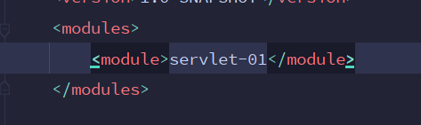

子项目中有：

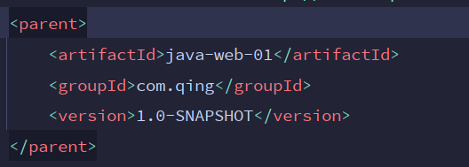

**子项目可以直接使用父项目的依赖**

**Maven环境优化**

将`web.xml`文件换成最新的

```xml
<web-app xmlns="http://xmlns.jcp.org/xml/ns/javaee"
  xmlns:xsi="http://www.w3.org/2001/XMLSchema-instance"
  xsi:schemaLocation="http://xmlns.jcp.org/xml/ns/javaee
                      http://xmlns.jcp.org/xml/ns/javaee/web-app_4_0.xsd"
  version="4.0"
  metadata-complete="false"> 

</web-app>
```

- `metadata-complete="false"`

  该属性为true，则容器在部署时只依赖部署描述文件，忽略所有标注，如果不配置该属性，或者将其设置为false，则表示启动注解支持，对以后通过注解配置资源路径至关重要。

该文件可以在`apache-tomcat-9.0.58-windows-x64\apache-tomcat-9.0.58\webapps\ROOT\WEB-INF`中找到。

**编写Servlet**

两种方式：

1. 创建一个普通类，实现Servlet接口，添加`@WebServlet`注解，通过注解说明自己能处理的路径。

   早期的Servlet需要在web.xml中配置映射路径，但最新Servlet版本只需通过注解就可以完成映射。

2. Servlet有两个默认的实现类：`HttpServlet`，`GenericServlet`。这两个类都是抽象类，但`GenericServlet`并没有重写Servlet接口的service方法

   继承关系：`普通类 -> HttpServlet -> GenericServlet -> Servlet接口`

   下面的Servlet继承`HttpServlet`，并覆写`doGet`和`doPost`方法，在响应中写入`Hello Servlet!`，并在终端输出“进入doGet方法”，则证明Servlet启动成功。

   ```java
   package com.qing.servlet;
   
   import javax.servlet.*;
   import javax.servlet.http.*;
   import javax.servlet.annotation.*;
   import java.io.IOException;
   import java.io.PrintWriter;
   
   public class HelloServlet extends HttpServlet {
       @Override
       protected void doGet(HttpServletRequest request, HttpServletResponse response) throws ServletException, IOException {
           System.out.println("进入doGet方法");
           PrintWriter writer = response.getWriter();
           writer.print("Hello Servlet!");
       }
   
       @Override
       protected void doPost(HttpServletRequest request, HttpServletResponse response) throws ServletException, IOException {
           doGet(request, response);
       }
   }
   
   ```

**编写Servlet映射**

为什么需要映射：我们写的是Java程序，但是需要通过浏览器访问，而浏览器需要连接web服务器，所以我们需要web服务中注册我们写的Servlet，还需要浏览器给他一个能够访问的路径

```xml
  <!--注册Servlet-->
  <servlet>
    <servlet-name>hello</servlet-name>
    <servlet-class>com.qing.servlet.HelloServlet</servlet-class>
  </servlet>
  <!--Servlet的请求路径-->
  <servlet-mapping>
    <servlet-name>hello</servlet-name>
    <url-pattern>/hello</url-pattern>    // 注意这里是/hello
  </servlet-mapping>
```

查找顺序：`url-pattern -> servlet-name -> servlet-class` 

也可以通过注解配置Servlet的映射路径，该方法更加简洁方便。

​	**mapping问题**

1. 一个Servlet可以指定一个或多个路径

   ```xml
     <servlet>
       <servlet-name>hello</servlet-name>
       <servlet-class>com.qing.servlet.HelloServlet</servlet-class>
     </servlet>
     <servlet-mapping>
       <servlet-name>hello</servlet-name>
       <url-pattern>/hello</url-pattern>
     </servlet-mapping>
     <servlet-mapping>
       <servlet-name>hello</servlet-name>
       <url-pattern>/hello2</url-pattern>
     </servlet-mapping>
     <servlet-mapping>
       <servlet-name>hello</servlet-name>
       <url-pattern>/hello3</url-pattern>
     </servlet-mapping>
   ```

2. 一个Servlet可以指定通用映射路径

   ```xml
     <servlet-mapping>
       <servlet-name>hello</servlet-name>
       <url-pattern>/hello/*</url-pattern>  // 通配符
     </servlet-mapping>
   
   <!--默认请求路径-->
     <servlet-mapping>
       <servlet-name>hello</servlet-name>
       <url-pattern>/*</url-pattern>  // 注意*前面不能加项目映射的路径
     </servlet-mapping>
   
   <!--指定后缀或前缀-->
     <servlet-mapping>
       <servlet-name>hello</servlet-name>
       <url-pattern>*.do/*</url-pattern>  // 注意*前面不能加项目映射的路径
     </servlet-mapping>
   ```

   路径优先级问题：制定了固有的映射路径优先级最高，如果找不到就会走默认的处理请求

之后配置Tomcat，启动

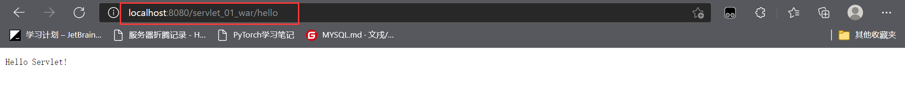

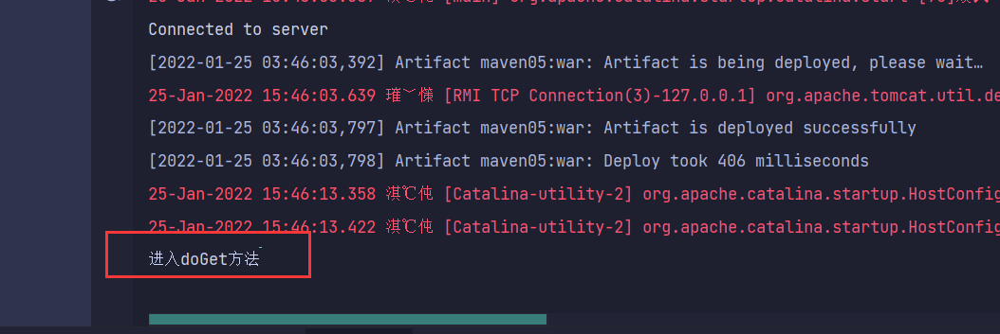


## Servlet原理

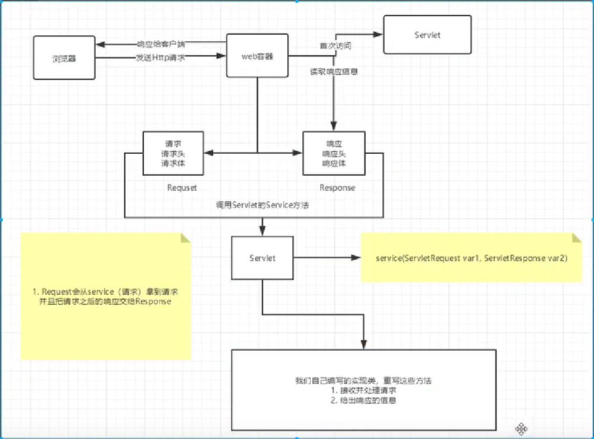

这里需要注意，`Request`和`Response`是由web容器自动创建的，web容器创建完成之后，将`Request`和`Response`传入servlet，并调用`doGet()`或`doPost()`方法，处理响应和请求。

我们将来开发B/S架构的web项目，都是针对HTTP协议，所以我们自定义的Servlet，会继承`HttpServlet`。

**一个Servlet总是继承自`HttpServlet`，然后覆写`doGet()`或`doPost()`方法**。`doGet()`方法传入了`HttpServletRequest`和`HttpServletResponse`两个对象，分别代表HTTP请求和响应。我们使用Servlet时，并不直接与底层TCP交互，也不需要解析HTTP协议，因为`HttpServletRequest`和`HttpServletResponse`就已经封装好了请求和响应。

一个最简单的Servlet实现类：

```java
// @WebServlet注解表示这是一个Servlet，并映射到地址/:
@WebServlet("/")
public class HelloServlet extends HttpServlet {
    protected void doGet(HttpServletRequest req, HttpServletResponse resp)
            throws ServletException, IOException {
        // 设置响应类型:
        resp.setContentType("text/html");
        // 获取输出流:
        PrintWriter pw = resp.getWriter();
        // 写入响应:
        pw.write("<h1>Hello, world!</h1>");
        // 最后不要忘记flush强制输出:
        pw.flush();
    }
}
```

实际上，类似Tomcat这样的服务器也是Java编写的，<u>启动Tomcat服务器实际上是启动JVM</u>，执行Tomcat的`main()`方法，然后由Tomcat负责加载我们的`.war`文件，并创建一个`HelloServlet`实例，最后<u>以多线程的模式来处理HTTP请求</u>。

因为我们编写的Servlet并不是直接运行，而是由Web服务器加载后创建实例运行，所以，<u>类似Tomcat这样的Web服务器也称为Servlet容器</u>。

在Servlet容器中运行的Servlet具有如下特点：

- 无法在代码中直接通过new创建Servlet实例，必须由Servlet**容器自动创建**Servlet实例
- Servlet容器只会给每个Servlet类创建**唯一实例**
- Servlet容器会使用**多线程**执行`doGet()`或`doPost()`方法

## Servlet多线程模型

一个Servlet类在服务器中只有一个实例，但对于每个HTTP请求，Web服务器会使用多线程执行请求。因此，**一个Servlet的`doGet()`、`doPost()`等处理请求的方法是多线程并发执行的**。如果Servlet中定义了字段，要注意多线程并发访问的问题。

```java
public class HelloServlet extends HttpServlet {
    private Map<String, String> map = new ConcurrentHashMap<>();
    protected void doGet(HttpServletRequest req, HttpServletResponse resp) throws ServletException, IOException {
        // 注意读写map字段是多线程并发的:
        this.map.put(key, value);
    }
}
```

- <u>在Servlet的`doGet(),doPost()`等方法中定义的实例变量会被多个线程同时访问，要注意线程安全。</u>
- `HttpServletRequest`和`HttpServletResponse`实例是由Servlet容器传入的局部变量，它们只能被当前线程访问，不存在多个线程访问的问题。
- 在`doGet()`或`doPost()`方法中，如果使用了`ThreadLocal`，但没有清理，那么它的状态很可能会影响到下次的某个请求，因为Servlet容器很可能用线程池实现线程复用。
  - `ThreadLocal`是JDK包提供的，它提供线程本地变量.当使用`ThreadLocal`维护变量时，`ThreadLocal`为每个使用该变量的线程提供独立的变量副本，所以每一个线程都可以独立地改变自己的副本，而不会影响其它线程所对应的副本。

## Servlet执行流程

- 加载和实例化：在默认情况下，当Servlet第一次被访问时，由容器创建Servlet对象
- 初始化：在Servlet实例化之后，容器将会调用Servlet的`init()`方法初始化这个对象，完成一些如加载配置文件，创建连接等初始化的工作。该方法只调用一次，**在初次访问时调用**。
- 请求处理：**每次请求**Servlet时，Servlet容器都会调用Servlet的**`service()`**方法对请求进行处理。
  - `HttpServlet`的`doGet()`和`doPost()`方法本质也是`service()`。`HttpServlet`中覆写的`service()`方法其实是将对请求的处理交给了`doGet()`和`doPost()`等请求方法。
- 服务终止：当需要释放内存或者服务器关闭时，容器就会调用Servlet实例的**`destory()`**方法完成资源的释放。在`destory()`方法调用之后，容器会释放这个Servlet实例，该实例随后会被Java的垃圾回收站所回收

```java
@WebServlet(urlPatterns="/demo",loadOnStartup=1)
```

**`loadOnStartup`参数**：

负整数：第一次被访问时创建Servlet对象(默认为-1)

0或正整数：服务器启动时创建Servlet对象，数字越小优先级越高

## ServletContext

一个Web服务器可以运行一个或多个Webapp。对于每个Webapp，Web服务器在启动的时候，它会为每个webapp创建一个**全局唯一**的`ServletContext`实例，它代表了当前的web应用，跟**`applicationContext`**是同一个东西。

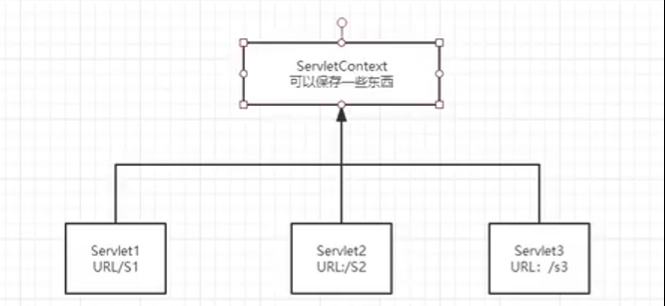

`Servletrequest`，`HttpSession`等很多对象都提供了`getServletContext()`方法获取到同一个`ServletContext`实例。**`ServletContext`实例最大的作用就是设置和共享全局信息。**

### 共享数据

在一个Servlet中保存的数据，可以在另一个Servlet中拿到

下面的例子中，在`HelloServelet.java`中储存进`ServletContext`中的值，在`GetServlet.java`中可以取出来

1. 编写`HelloServelet.java`

   ```java
   @WebServlet(name = "HelloServlet", value = "/HelloServlet")
   public class HelloServlet extends HttpServlet {
       @Override
       protected void doGet(HttpServletRequest request, HttpServletResponse response) throws ServletException, IOException {
           ServletContext context = this.getServletContext();
           String username = "laowang";
           context.setAttribute("username",username);  // 将数据保存在ServletContext中，名字为username,值为username变量
       }
   
       @Override
       protected void doPost(HttpServletRequest request, HttpServletResponse response) throws ServletException, IOException {
           doGet(request,response);
       }
   }
   ```

2. 编写`GetServlet.java`

   ```java
   @WebServlet(name = "GetServlet", value = "/GetServlet")
   public class GetServlet extends HttpServlet {
       @Override
       protected void doGet(HttpServletRequest request, HttpServletResponse response) throws ServletException, IOException {
           ServletContext servletContext = this.getServletContext();
           String username = (String)servletContext.getAttribute("username");
           // 设置响应格式
           response.setContentType("text/html;charset = UTF-8");
           response.getWriter().print("Hello,"+username);
       }
   ```

3. 修改`web.xml`文件

   ```xml
     <servlet>
       <servlet-name>ServletContext</servlet-name>
       <servlet-class>com.qing.servlet.HelloServlet</servlet-class>
     </servlet>
     <servlet-mapping>
       <servlet-name>ServletContext</servlet-name>
       <url-pattern>/hello</url-pattern>
     </servlet-mapping>
   
     <servlet>
       <servlet-name>Context</servlet-name>
       <servlet-class>com.qing.servlet.GetServlet</servlet-class>
     </servlet>
     <servlet-mapping>
       <servlet-name>Context</servlet-name>
       <url-pattern>/get</url-pattern>
     </servlet-mapping>
   ```

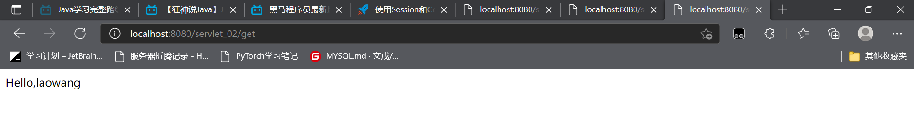

但这种方式并不常用，我们通常使用`session`和`Cookie`来储存信息。

### 获取初始化参数

```xml
<!--配置一些web应用初始化参数-->
  <context-param>
    <param-name>url</param-name>
    <param-value>jdbc:mysql://localhost:3306/mybatis</param-value>
  </context-param>
  <servlet>
    <servlet-name>jdbc</servlet-name>
    <servlet-class>com.qing.servlet.ParamServlet</servlet-class>
  </servlet>
  <servlet-mapping>
    <servlet-name>jdbc</servlet-name>
    <url-pattern>/jdbc</url-pattern>
  </servlet-mapping>
```

```java
@WebServlet(name = "ParamServlet", value = "/ParamServlet")
public class ParamServlet extends HttpServlet {
    @Override
    protected void doGet(HttpServletRequest request, HttpServletResponse response) throws ServletException, IOException {
        ServletContext servletContext = this.getServletContext();
        String url = servletContext.getInitParameter("url");
        response.getWriter().print(url);
    }
```

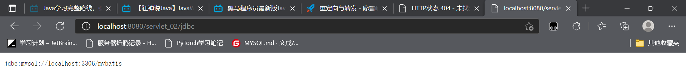

### 读取资源文件

原理：将文件变为一个流，并通过`ServletContext`对象读取流

- 在`Java或resource`目录下新建`.properties`(资源文件)

  ```properties
  username:hujingjing
  password:123456
  ```

- `PropertiesServlet.java`

  ```java
  @WebServlet(name = "PropertiesServlet", value = "/PropertiesServlet")
  public class PropertiesServlet extends HttpServlet {
      @Override
      protected void doGet(HttpServletRequest request, HttpServletResponse response) throws ServletException, IOException {
          // 以流的形式读取文件
          InputStream is = this.getServletContext().getResourceAsStream("/WEB-INF/classes/aa.properties");
          Properties prop = new Properties();
          prop.load(is);
          String username = prop.getProperty("username");
          String password = prop.getProperty("password");
          response.getWriter().print(username+":"+password);
      }
  ```

**`Classpath`**

发现：Java和resource目录下的文件都被打包到了同一路径下，这个路径称为`classpath`

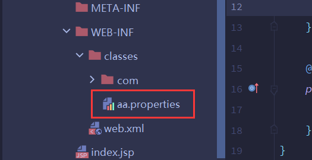

**`classpath`**：**类路径**。Java和resource统称`classpath`。即**`WEB-INF/classses`**

注意：resource目录下的文件可以被直接打包进`classpath`，但Java目录下的文件**需要配置**(即防止资源过滤)才可以打包进`classpath`

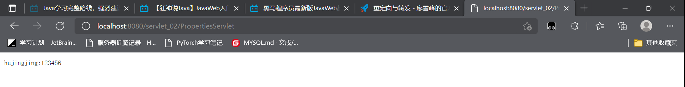

## HttpServletResponse

web服务器接收到客户端的http请求时，分别创建一个代表请求的`HttpServletResponse`对象和`HTTPServletRequest`对象

`HttpServletResponse`封装了一个HTTP响应，由于HTTP响应必须先发送Header，再发送Body，所以，操作`HttpServletResponse`对象时，必须先调用设置Header的方法，最后调用发送Body的方法。

==常用方法==

负责向浏览器发送数据：写入响应时，需要通过`getOutputStream()`获取写入流，或者通过`getWriter()`获取字符流，二者只能获取其中一个

```java
ServletOutputStream getOutputStream() throws IOException;
PrintWrite getWriter() throws IOException;
```

负责向浏览器发送响应头

- `setStatus(sc)`：设置响应代码，默认是`200`；
- `setContentType(type)`：设置Body的类型，例如，`"text/html"`；
- `setCharacterEncoding(charset)`：设置字符编码，例如，`"UTF-8"`；
- `setHeader(name, value)`：设置一个Header的值；
- `addCookie(cookie)`：给响应添加一个Cookie；
- `addHeader(name, value)`：给响应添加一个Header，因为HTTP协议允许有多个相同的Header；

但是，写入完毕后**调用`flush()`**是必须的，因为大部分Web服务器都基于HTTP/1.1协议，会复用TCP连接。如果没有调用`flush()`，将导致缓冲区的内容无法及时发送到客户端。此外，写入完毕后千万**不要调用`close()`**，原因同样是因为会复用TCP连接，如果关闭写入流，将关闭TCP连接，使得Web服务器无法复用此TCP连接。

应用(了解)：

- 验证码功能

- 下载文件

  ```java
  public class IoServlet extends HttpServlet {
      @Override
      protected void doGet(HttpServletRequest request, HttpServletResponse response) throws ServletException, IOException {
          //1.要获取下载文件的路径：使用绝对路径
          String realPath = "C:\\Users\\hujingjing\\Desktop\\Snipaste_2022-01-21_14-41-43.png";
          //2.获取下载文件的文件名
          String fileName = "Snipaste_2022-01-21_14-41-43.png";
          //3.设置让浏览器能够支持下载我们的文件
          response.setHeader("Content-Disposition","attachment;filename"+fileName);
          //4.获取下载文件的输入流
          FileInputStream in = new FileInputStream(realPath);
          //5.创建缓冲区
          int len = 0;
          byte[] buffer = new byte[1024];
          //6.获取OutputStream对象
          ServletOutputStream out = response.getOutputStream();
          //7.将FileOutputStream流写入缓冲区，使用OutputStream将缓冲区中的数据输出到客户端
          while((len=in.read(buffer))>=0) {
              out.write(buffer,0,len);
          }
          in.close();
          out.close();
      }
  ```

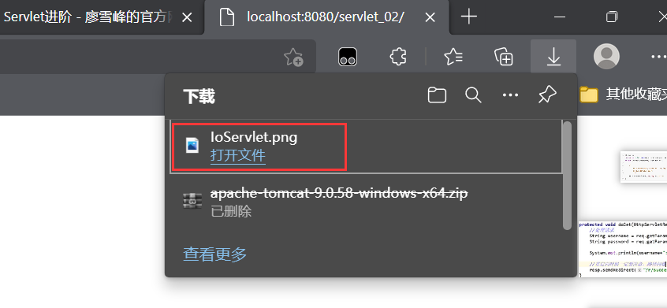

## HttpServletRequest

`HttpServletRequest`封装了一个HTTP请求，我们通过`HttpServletRequest`提供的接口方法可以拿到HTTP请求的几乎全部信息

**==常用方法==**

- `getMethod()` 返回请求方法
- `getRequestURL()`  返回请求路径，但不包括请求参数
- `getQueryString(name) `返回请求参数。如：`“name=chun&age=3”`
- **`getParameter(name)`** 返回请求参数。**GET方法从URL中读取参数，POST方法从Body中读取参数**
- `getParameterValues(name)` 返回含有多个值的请求参数，如多选框。
- **`setAttribute(),getAttribute()`**给当前对象附加`Key-Value`。
- `getContentType() `获取请求Body的类型
- **`getContextPath()` 获取当前`Webapp`挂载的路径**。对于`ROOT`返回`“”`
- `getCookies()`：返回请求携带的所有`Cookie`；

`// 了解`

- `getHeader(name)`：获取指定的Header，对Header名称不区分大小写；
- `getHeaderNames()`：返回所有Header名称；
- `getInputStream()`：如果该请求带有HTTP Body，该方法将打开一个输入流用于读取Body；
- `getReader()`：和getInputStream()类似，但打开的是Reader；
- `getRemoteAddr()`：返回客户端的IP地址；
- `getScheme()`：返回协议类型，例如，`"http"`，`"https"`；

## 重定向与转发

### `Forward`

`forward`是指内部转发。当一个Servlet处理请求的时候，它可以决定自己不继续处理，而是转发给另一个Servlet处理。

举个栗子：

```java
@WebServlet(urlPatterns = "/morning")
public class ForwardServlet extends HttpServlet {
    protected void doGet(HttpServletRequest req, HttpServletResponse resp) throws ServletException, IOException {
        req.getRequestDispatcher("/hello").forward(req, resp); //将响应和请求转发
    }
}
```

**注意：`getRequestDispatcher()`分为两种：**

- `request.getRequestDispacher(url)` 其中的url**可以是相对路径也可以是绝对路径**
- `this.getServletContext().getRequestDispacher(url)` 其中的url必须是绝对路径

`ForwardServlet`在接受请求后，它并不自己发送响应，而是把请求和响应都转发给路径为`/hello`的Servlet。流程图如下：

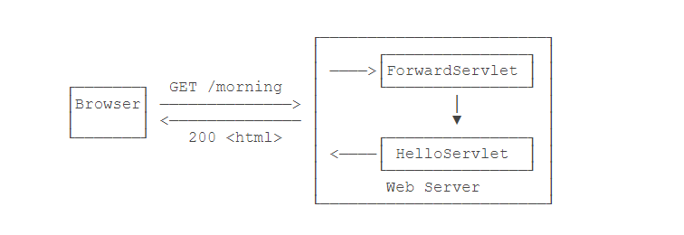

注意到使用转发的时候，浏览器的地址栏路径仍然是`/morning`，浏览器并不知道该请求在Web服务器内部实际上做了一次转发。

转发和重定向的区别在于：转发是在Web服务器内部完成的，对浏览器来说，它只发送了一次HTTP请求

### `Redirect`

重定向是指：当浏览器请求一个url时，服务器返回一个重定向指令，告诉浏览器url已经变更，请浏览器使用新的url再发送请求

**作用**

重定向的目的是当Web应用升级后，如果请求路径发生了变化，可以将原来的路径重定向到新路径，从而避免浏览器请求原路径找不到资源。

```java
@WebServlet(urlPatterns = "/hi")
public class RedirectServlet extends HttpServlet {
    protected void doGet(HttpServletRequest req, HttpServletResponse resp) throws ServletException, IOException {
        // 发送重定向响应:
        resp.sendRedirect("/s/hello"); 
    }
}
```

**注意：要注意路径问题，`sendRedirect()`中的参数是`localhost`后面完整路径**

浏览器发送了**两次**http请求，并且浏览器的地址栏路径自动更新为`/hello`

如果浏览器发送`GET /hi`请求，`RedirectServlet`将处理此请求。由于`RedirectServlet`在内部又发送了重定向响应，因此，**浏览器会收到如下响应**：

```http
HTTP/1.1 302 Found
Location: /hello
```

当浏览器收到302响应后，它会立刻根据`Location`的指示发送一个新的`GET /hello`请求，这个过程就是重定向：

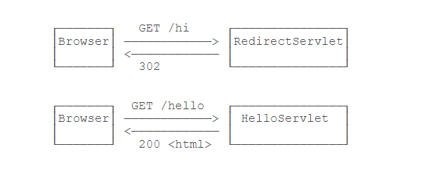

重定向有两种：一种是302响应，称为**临时重定向**，一种是301响应，称为**永久重定向**。两者的区别是，如果服务器发送301永久重定向响应，浏览器会缓存`/hi`到`/hello`这个重定向的关联，下次请求`/hi`的时候，浏览器就直接发送`/hello`请求了。

如果要实现301永久重定向，可以这么写：

```java
resp.setStatus(HttpServletResponse.SC_MOVED_PERMANENTLY); // 301
resp.setHeader("Location", "/hello");
```

### 路径问题

是否需要加虚拟目录？

- 给服务器使用：不需要加虚拟目录。如`forward()`
- 给浏览器使用：需要加虚拟目录。如`<a>`，`<form>`，`sendRedirect()`

**可以使用`request.getContextPath()`获取当前的虚拟目录**

```java
response.sendDirect(request.getContextPath()+"/hello")
```

重定向应用：

- 登录 

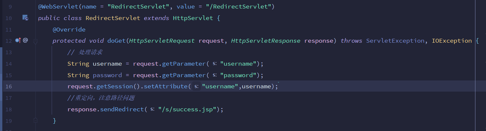

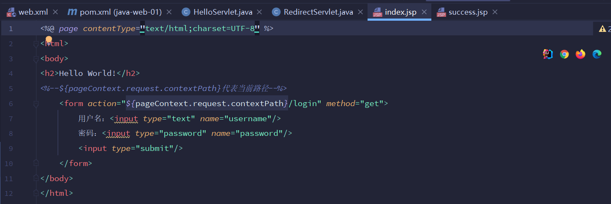

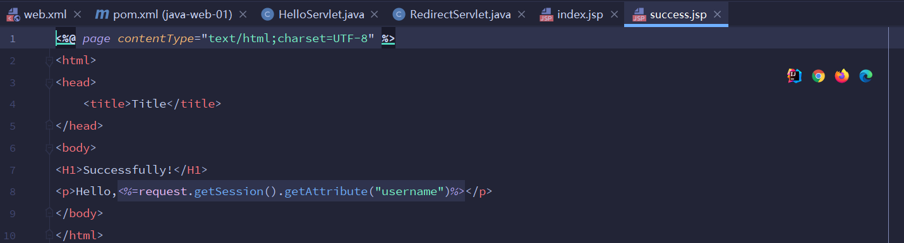

---

## Session和Cookie

> 因为HTTP协议是一个无状态协议，即Web应用程序无法区分收到的两个HTTP请求是否是同一个浏览器发出的。为了跟踪用户状态，服务器可以向浏览器分配一个唯一ID，并**以Cookie的形式发送到浏览器**，浏览器在后续访问时总是附带此Cookie，这样，服务器就可以识别用户身份。

### session

我们上面把基于唯一ID识别用户身份的**机制**称为Session。每个用户第一次访问服务器后，会自动获得一个Session ID。<u>如果用户在一段时间内没有访问服务器，那么Session会自动失效</u>，下次即使带着上次分配的Session ID访问，服务器也认为这是一个新用户，会分配新的Session ID。

以登录为例，在判断用户登录成功后，将用户名放入当前`HttpSession`中：

```java
// 将用户数据存入session
HttpSession session = req.getSession();
session.setAttribute("user", name);
```

用户再次登录时，可以从session中取出用户名判断之前是否登录过：

```java
// 从HttpSession获取当前用户名:
String user = (String) req.getSession().getAttribute("user");
```

如果用户已登录，显示登出按键。登出的原理就是从`HttpSession`中移除用户相关信息

```java
// 从HttpSession移除用户名:
req.getSession().removeAttribute("user");
```

注销session

```java
session.invalidate();  // 手动注销session
```

设置session的有效时间

```xml
<session-config>
    <!--15分钟后失效，以分钟为单位-->
    <session-timeout>15</session-timeout>   
</session-config>
```

**服务器识别Session的关键就是依靠一个名为`JSESSIONID`的`Cookie`**。在Servlet中第一次调用`req.getSession()`时，Servlet容器自动创建一个`Session ID`，然后通过一个名为**`JSESSIONID`**的Cookie发送给浏览器。

要注意的几点是：

- `JSESSIONID`是**由Servlet容器自动创建**的，目的是维护一个浏览器会话，它和我们的登录逻辑没有关系；
- 登录和登出的业务逻辑是我们自己根据`HttpSession`是否存在一个`"user"`的Key判断的，登出后，`Session ID`并不会改变；
- 可以使用`HttpSession`追踪用户，例如，放入一些用户配置信息等。
- session能存储的空间较小，因此放入的session对象要尽可能小。

#### ==session原理==

session是基于Cookie实现的。

在Servlet中第一次调用`req.getSession()`时，Servlet容器自动创建一个`Session ID`，然后将一个名为**`JSESSIONID`**的Cookie发送给浏览器，即`set-Cookie:JSESSIONID=xxx`。浏览器在后续访问时总是在请求中携带此Cookie，服务器就可以借此识别用户身份。

在一次会话中`request.getSession()`获取到的session对象永远是同一个。我们可以通过这个相同的session对象共享数据。

**Session的钝化&活化**

既然session存储在服务器中。服务器重启后，Session中的数据是否存在？

答案是显然的。

钝化：在服务器正常关闭后，Tomcat会自动将Session数据写入硬盘的文件中

活化：再次启动服务器之后，从文件中加载数据到Session中。

### Cookie

实际上，Servlet提供的`HttpSession`本质上就是通过一个名为`JSESSIONID`的Cookie来跟踪用户会话的。除了这个名称外，其他名称的Cookie我们可以任意使用。

我们既可以从请求中拿到Cookie信息，也可以由服务端响应给客户端Cookie

创建一个新的Cookie，记录用户选择的语言：

```java
protected void doGet(HttpServletRequest request, HttpServletResponse response) throws ServletException, IOException {

    String lang = request.getParameter("lang");
    if(LANGUAGES.contains(lang)) {
        // 创建一个Cookie
        Cookie cookie = new Cookie("lang", lang);
        // 设置Cookie的生效路径
        cookie.setPath("/");
        // 该Cookie有效期
        cookie.setMaxAge(8640000);  // 单位为秒
        // 将Cookie添加至响应
        response.addCookie(cookie);
    }
    response.sendRedirect("/");   // 重定向
}
```

注意：

- 创建Cookie时通常需要设置`setPath("/")`，**浏览器根据此前缀决定是否发送Cookie**。

  如果一个Cookie调用了`setPath("/user/")`，那么浏览器只有在请求以`/user/`开头的路径时才会附带此Cookie。

- 如果访问的是https，还需要设置`setSecure(true)`，否则浏览器不会发送该Cookie。

- **如果没有设置Cookie的有效期，那么关闭浏览器时Cookie自动失效**。

因此，务必注意：浏览器在请求某个URL时，是否携带指定的Cookie，取决于Cookie是否满足以下所有要求：

- URL前缀是设置Cookie时的Path
- Cookie在有效期内
- Cookie设置了secure时必须以https访问

**读取Cookie**：遍历Request中所有的Cookie

```java
public String parseLanguageFormCookie(HttpServletRequest req) {
    Cookie[] cookies = request.getCookies();
    if(cookies != null) {
        for(Cookie cookie:cookies) {
            // 找到名称为lang的Cookie
            if (cookie.getName().equals("lang")) {
                return cookie.getValue();
            }
        }
    }
    // 返回默认值
    return "en";
}
```

#### ==Cookie原理==

Cookie是基于http协议实现的。

Cookie工作流程：

1. 首先由服务器将Cookie写入响应，即在响应头中增加`set-Cookie:username=cs`。
2. 浏览器接受响应后，会自动识别Cookie，并将Cookie保存在客户端。
3. 浏览器下次再发送请求时(两次访问的Servlet可以不同)，如果满足携带Cookie的条件，会将Cookie放在请求头中，即`Cookie:username=cs`。

#### Cookie细节

- 默认情况下，Cookie是储存在浏览器的内存中的，当浏览器关闭时，资源释放，Cookie就会被销毁。

- 在Tomcat8之前，Cookie不支持存储中文。在Tomcat8之后仍然有些特殊字符不能存入Cookie。如果需要存储中文的话，我们需要在设置Cookie时将Cookie的值转码，在获取到Cookie时再将Cookie的值解码。

  **解决Cookie的中文乱码问题**

  ```java
  // 设置编码
  Cookie cookie = new Cookie("name", URLEncoder.encode("春实","UTF-8"));
  // 解码
  URLDecoder.decode(cookie.getValue(),"UTF-8");
  ```


### ==session与Cookie的区别==

- Cookie是把用户的数据写给用户的浏览器，保存在**客户端**
- session是把用户的数据写到用户独占session中，保存在**服务端**
- 存储数据量大小不同：cookie不超过4K
- session在关闭浏览器时就会被销毁，因此不能长期保存数据，而Cookie可以写在所在电脑的磁盘里长期保存，更适合用来储存数据。

## JSP

使用`PrintWrite`输出HTML太过麻烦，jsp可以帮我们更简单的输出HTML。

jsp文件必须放到**`/src/main/webapp`**下，以`.jsp`结尾

jsp与HTML并无太大区别，但需要插入变量，或者动态输出的地方，使用特殊指令`<% ... %>`。

- 包含在`<%--`和`--%>`之间的是JSP的注释，它们会被**完全忽略**；
- 包含在`<%`和`%>`之间的是Java代码，可以编写任意**Java代码**；
- 如果使用`<%= xxx %>`则可以**快捷输出**一个变量的值。

JSP页面内置了几个变量：

- `out`：表示`HttpServletResponse`的`PrintWriter`；
- `session`：表示当前`HttpSession`对象；
- `request`：表示`HttpServletRequest`对象。

这些变量可以直接使用。

**JSP与Servlet的区别**

JSP在执行前首先被编译成一个Servlet。在Tomcat的临时目录下，可以找到一个`hello_jsp.java`的源文件，这个文件就是Tomcat把JSP自动转换成的Servlet源码

因此**JSP本质上就是一个Servlet**，只不过无需配置映射路径，Web Server会根据路径查找对应的`.jsp`文件，如果找到了，就自动编译成Servlet再执行。在服务器运行过程中，如果修改了JSP的内容，那么服务器会自动重新编译。

总结：**浏览器向服务器发送请求，不管访问什么资源，其实都是在访问Servlet**

**jsp高级语法**

```jsp
// 引入Java类
<%@ page import="java.util.*"%>
// 引入另一JSP文件
<%@ include file="footer.jsp"%>
// JSP Tag
<c:out value = "${sessionScope.user.name}"/>
```

**JavaBean**

即实体类，有特定的写法：

- 必须要有一个无参构造
- 属性必须私有化
- 必须有对应的`get/set`方法

一般用来和数据库的字段做一一对应。

## MVC开发

- Servlet适合编写Java代码，实现各种复杂的业务逻辑，但不适合输出复杂的HTML；
- JSP适合编写HTML，并在其中插入动态内容，但不适合编写复杂的Java代码。

MVC设计模式，即`Model-View-Controller`，就是将两者结合，并将各自的的优点发挥出来。

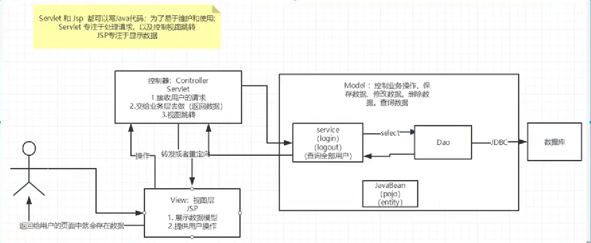

在**`UserServlet`**中，我们可以从数据库中读取信息，再将读取到的信息放到`HttpServletRequest`中，再通过`forward()`传给`user.jsp`处理

```java
@WebServlet(urlPatterns = "/user")
public class UserServlet extends HttpServlet {
    protected void doGet(HttpServletRequest req, HttpServletResponse resp) throws ServletException, IOException {
        // 假装从数据库读取:
        School school = new School("No.1 Middle School", "101 South Street");
        User user = new User(123, "Bob", school);
        // 放入Request中:
        req.setAttribute("user", user);
        // forward给user.jsp:
        req.getRequestDispatcher("/WEB-INF/user.jsp").forward(req, resp);
    }
}
```

在**`user.jsp`**中，只负责展示相关信息，不需要编写访问数据库等复杂逻辑

注意：

- 需要展示的`User`被放入`HttpServletRequest`中以便传递给JSP，因为一个请求对应一个`HttpServletRequest`，我们也无需清理它，处理完该请求后`HttpServletRequest`实例将被丢弃
- 把`user.jsp`放到`/WEB-INF/`目录下，是因为`WEB-INF`是一个特殊目录，**Web Server会阻止浏览器对`WEB-INF`目录下任何资源的访问**，这样就防止用户通过`/user.jsp`路径直接访问到JSP页面。之后我们可以用过滤器实现拦截。
- JSP页面首先从`request`变量获取`User`实例，然后在页面中直接输出，此处未考虑HTML的转义问题，有潜在安全风险。

我们把`UserServlet`看作业务逻辑处理，把`User`看作模型，把`user.jsp`看作渲染，整个MVC架构如下：

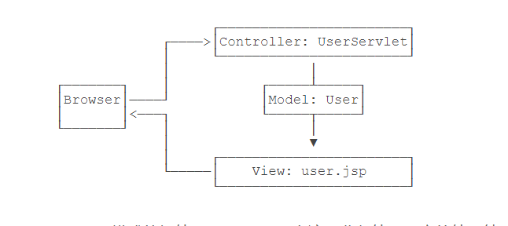

`Model`

- 业务处理：业务逻辑(Service)
- 数据持久层：CRUD(Dao)

`View`

- 展示数据
- 提供链接发起Servlet请求(a,form,img…)

`Controller(Servlet)`

- 接受用户请求
- 交给业务层处理对应的代码
- 控制视图层的跳转

使用MVC模式的好处是，Controller专注于业务处理，它的处理结果就是Model。Model可以是一个JavaBean，也可以是一个包含多个对象的Map，**Controller只负责把Model传递给View，View只负责把Model给“渲染”出来**，这样，三者职责明确，且开发更简单，因为开发Controller时无需关注页面，开发View时无需关心如何创建Model。但它还不够简洁和灵活。

**==关于Dao层和Service层的理解==**

Dao是数据访问层，封装对数据库的访问，不涉及业务逻辑，只是按某个条件获得某个数据的要求。即**只负责接受最终的sql语句，具体到某一张表的增删改查**。

Service是业务层，专注于**业务逻辑**。**Service的工作是接受Servlet，同时又调用Dao**。我们需要用Service层去调用Dao层。

层级关系：

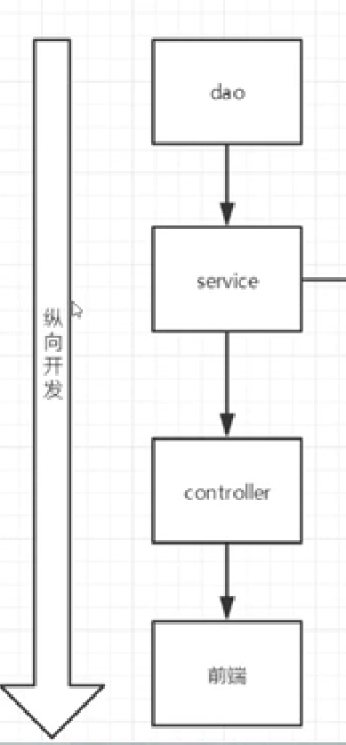

**一个Service层控制一个或多个Dao层**

我们为什么要通过Service层去调用Dao层？

这样最大的好处就是：**解耦**。即降低代码之间的耦合，尽量让代码之间不要有太大的联系。当部分代码改动时，其他部分可以不需要修改，易于维护。

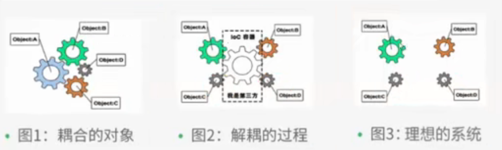

但我们不一定非要service层去调用Dao层。对于极小的项目而言，只需要Dao层就能处理，增加service层反而增加了代码量，那么此时service层就不再需要了。

参考博客：[ DAO层和Service层的究极理解--这波我在大气层](https://blog.csdn.net/bookssea/article/details/107488749)

## Filter

为了把一些公用逻辑从各个Servlet中抽离出来，JavaEE的Servlet规范还提供了一种Filter组件，即过滤器。它的作用是，在HTTP请求到达Servlet之前，可以被一个或多个`Filter`预处理，类似打印日志、登录检查等逻辑，可以放到`Filter`中。

`Filter`是一种对HTTP请求进行预处理的组件，他可以构成一个处理链，是的公共处理代码能集中到一块，适用于日志，登录检查，全局设置等

例如，编写一个设置编码的过滤器：

```java
@WebFilter(urlPatterns = "/*")
public class EncodingFilter implements Filter {
    @Override
    public void doFilter(ServletRequest request, ServletResponse response, FilterChain chain) throws ServletException, IOException {
        request.setCharacterEncoding("UTF-8");
        response.setCharacterEncoding("UTF-8");
        chain.doFilter(request, response); // 放行，如果不写程序到这里就会被拦截
    }
}
```

`web.xml`中的文件配置

```xml
<filter>
    <filter-name>EncodingFilter</filter-name>
    <filter-class>com.qing.servlet.EncodingFilter</filter-class>
</filter>
<filter-mapping>
    <filter-name>EncodingFilter</filter-name>
    <!--过滤任何/servlet开头的请求-->
    <url-pattern>/servlet/*</url-pattern>  
</filter-mapping>
```

过滤器的简单架构如下：
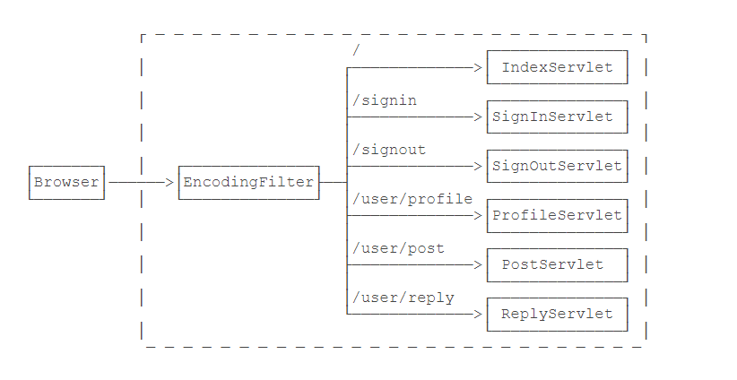

**过滤器链**

一个Web应用还可以添加其他Filter，**多个`Filter`会组成一个链**。

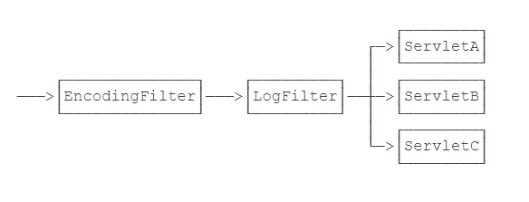

每个请求都会被链上的Filter依次处理，处理完毕之后，**返回的响应也会依次经过Filter**，顺序跟请求相反。

因此Filter放行之前的代码可以用来处理请求，放行之后的代码用来处理响应。

`Tips:` `Filter`的执行顺序是按照`web.xml`文件中的注册顺序来执行的。注解配置的Filter优先级按照多滤器类名的自然顺序来排序。

此外，`Filter`还可以有针对性地**拦截或者放行HTTP请求**。

例如下面验证用户是否登录，如果用户未登录就直接访问登录后的页面，就会被过滤器过滤

```java
@WebFilter(urlPatterns = "/user/*")
public class EncodingFilter implements Filter {
    @Override
    public void doFilter(ServletRequest request, ServletResponse response, FilterChain chain) throws ServletException, IOException {
        /*注意：此处需要强转，因为ServletRequest和ServletResponse无法获得session对象，需要强转为HttpServletRequest和HttpServletResponse*/
        HttpServletRequest req = (HttpServletRequest) request;
        HttpServletResponse resp = (HttpServletResponse) response;
        if (req.getSession().getAttribute("user") == null) {
            // 未登录，自动跳转到登录页
            System.out.println("not sign in!");
            resp.sendRedirect("/signin");
        }else {
            // 已登录，继续处理
            chain.doFilter(request,response);
        }
    }
}
```

注意：登录时，要注意跟登录页面有关的图片，样式和注册的相关内容等不能被拦截

**拦截路径**

- 目录拦截：`/user/*`
- 后缀名拦截：`*.jsp`
- 拦截所有：`/*`

**实例**

利用Filter实现登录

前端：`webapp/login.jsp`

```jsp
<html>
<head>
    <title>Title</title>
</head>
<body>
<h1>登录</h1>
<form action="${pageContext.request.contextPath}/login" method="get">
    <input type="text" name="username">
    <input type="submit">
</form>
</body>
</html>
```

`webapp/sys/success.jsp`

```jsp
<%@ page contentType="text/html;charset=UTF-8" language="java" %>
<html>
<head>
    <title>Title</title>
</head>
<body>
<h1>Successful!</h1>
<a href="${pageContext.request.contextPath}/loginout">注销</a>
</body>
</html>
```

`webapp/error.jsp`

```jsp
<%@ page contentType="text/html;charset=UTF-8" language="java" %>
<html>
<head>
    <title>Title</title>
</head>
<body>
<h1>Error</h1>
</body>
</html>
```

后台：`loginServlet.java`

```java
@WebServlet("/login")
public class loginServlet extends HttpServlet {
    @Override
    protected void doGet(HttpServletRequest request, HttpServletResponse response) throws ServletException, IOException {
        // 获取前端请求的参数
        String username = request.getParameter("username");
        if (username.equals("admin")) {
            //将session的值保存为session对应的id可以保证不会重复
            request.getSession().setAttribute(Constant.USER_SESSION,request.getSession().getId());
            response.sendRedirect("/servlet/sys/success.jsp");
        }else{
            response.sendRedirect("/servlet/error.jsp");
        }
    }
...
```

`loginOutServlet.java`

```java
@WebServlet("/loginout")
public class loginOutServlet extends HttpServlet {
    @Override
    protected void doGet(HttpServletRequest request, HttpServletResponse response) throws ServletException, IOException {
        String user_session =(String) request.getSession().getAttribute(Constant.USER_SESSION);
        if (user_session!=null) {
            // 移除session
            request.getSession().removeAttribute(Constant.USER_SESSION);
            response.sendRedirect("login.jsp");  //或者写成/servlet/login.jsp
        }else{
            response.sendRedirect("error.jsp");  //或者写成/servlet/error.jsp
        }
    }
...
```

`SysFilter.java`

```java
@WebFilter("/sys/*")
public class SysFilter implements Filter {
    @Override
    public void doFilter(ServletRequest request, ServletResponse response, FilterChain chain) throws ServletException, IOException {
        // 需要强转
        HttpServletRequest req = (HttpServletRequest) request;
        HttpServletResponse resp = (HttpServletResponse) response;
        if (req.getSession().getAttribute(Constant.USER_SESSION)==null) {
            resp.sendRedirect("/servlet/error.jsp");
        }
        chain.doFilter(request, response);
    }
}
```

`Constant.java`

```java
public class Constant {
    public final static String USER_SESSION = "USER_SESSION";
}
```

`Tips:`

- 将`USER_SESSION`单独保存为一个常量，这样当`session`的属性名需要修改时可以方便很多
- 一定要注意路径问题，不然直接死掉
- **路径加`/`代表绝对路径，即从根目录`http://localhost:8080`开始查找 ，不加`/`代表相对路径**。`/`可以代表当前路径
- jsp中`${pageContext.request.contextPath}`代表当前路径

## Listener

任何标注为`@WebListener`,且实现了特定接口的类会被Web服务器自动初始化。

常见的`Listener`：

- **`ServletContextListener`**：最常用，监听`ServletContext`实例的创建和销毁。会在整个Web应用程序初始化完成后，以及Web应用程序关闭后获得回调通知。

- `HttpSessionListener`：监听`HttpSession`的创建和销毁事件
- `ServletRequestListener`：监听`ServletRequest`请求的创建和销毁事件
- `ServletRequestAttributeListener`：监听`ServletRequest`请求的属性变化事件(即调用`ServletRequest.setAttribute()`方法)
- `ServletContextAttributeListener`：监听`ServletContext`的属性变化事件(即`ServletContext.setAttribute()`)

例如一个简单`ServletContextListener`接口实现类如下：

```java
@WebListener
public class MyListener implements ServletContextListener, HttpSessionListener, HttpSessionAttributeListener {
    // 在此初始化Webapp，例如打开数据库连接池等
    @Override
    public void contextInitialized(ServletContextEvent sce) {
        /* This method is called when the servlet context is initialized(when the Web application is deployed). */
    }
    // 在此清理Webapp，例如关闭数据库连接池等
    @Override
    public void contextDestroyed(ServletContextEvent sce) {
        /* This method is called when the servlet Context is undeployed or Application Server shuts down. */
    }
}
```

```xml
<listener>
    <listener-class>com.qing.servlet.MyListener</listener-class>
</listener>
```

很多第三方web框架都会通过一个`ServletContextListener`接口初始化自己。

我们可以把初始化数据库连接池等工作放到`contextInitialized()`回调方法中，把清理资源的工作放到`contextDestroyed()`回调方法中，因为Web服务器保证在`contextInitialized()`执行后，才会接受用户的HTTP请求。

## AJAX

概念：本质是**异步**的`JavaScript`和`XML`。并非编程语言。

作用

- 与服务器进行数据交换：通过`AJAX`可以给服务器发送请求，并获得服务器响应的数据。使用`AJAX+HTM`L可以替换JSP页面

- 异步交互：可以在不重新加载整个页面的情况下，与服务器交换数据并更新部分网页的技术

Ajax的核心是`XMLHttpRequest`对象。`XMLHttpRequest`对象用于同幕后服务器交换数据，所有现代浏览器都有该对象

编写步骤：

1. 编写`AjaxServlet`

   作用：作为后台 响应数据

2. 创建`XMLHttpRequest`对象，用于和服务器交换数据

   ```javascript
   var xmlhttp;
   if (window.XMLHttpRequest) {
   xmlhttp = new XMLHttpRequest();
   } else {
   // code for IE6, IE5
    xmlhttp = new ActiveXObject("Microsoft.XMLHTTP");
   }
   ```

3. 向服务器发送请求

   如需向服务器发送请求，我们使用 `XMLHttpRequest` 对象的 `open()` 和` send() `方法：

   ```javascript
   xmlhttp.open("GET", "http://localhost:8080/ajax_info.txt", true);
   xmlhttp.send();
   ```

   - `open(method,url,async)`
     - `method`请求的类型
     - `url`服务器位置。此处最好写全路径，因为将来可能会前后端分离
     - `async`：`true`（默认异步）`false`（同步）

4. 获取服务器响应数据

   ```javascript
   xmlhttp.onreadystatechange = function() {
     if (this.readyState == 4 && this.status == 200) {
       alert(xmlhttp.responseText);
     }
   };
   ```

   - **`onreadystatechange `属性**

     通过`XMLHttpRequest`对象，可以定义当请求收到答应时所执行的函数
     
   - **`readyState`**保存了`XMLHttpRequest`的状态

     - 0：请求未初始化
     - 1：服务器连接已建立
     - 2：请求正在接收
     - 3：正在处理请求
     - 4：请求已完成且响应已就绪

   - **`status`**

     - 200：OK
     - 404

   **每当`readyState`发生变化时就会调用`onreadystatechange`函数**

   当`this.readyState == 4 && this.status == 200`时，响应就绪

应用：

- 验证用户名是否存在
- 搜索关键词后的推荐

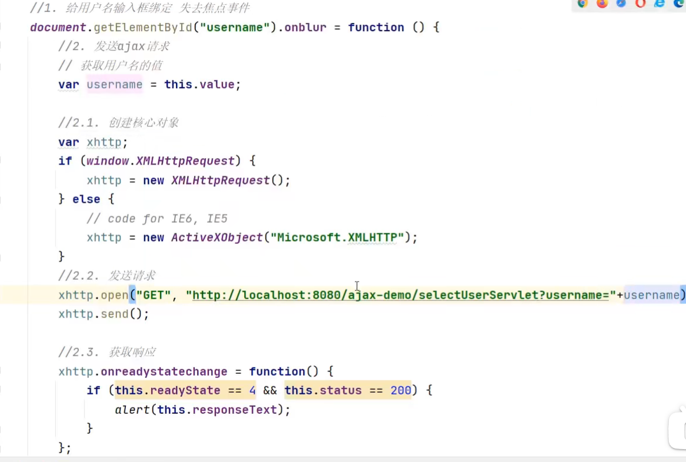

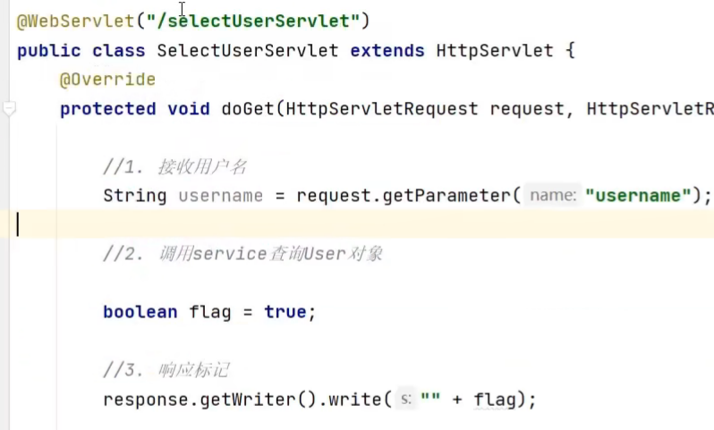

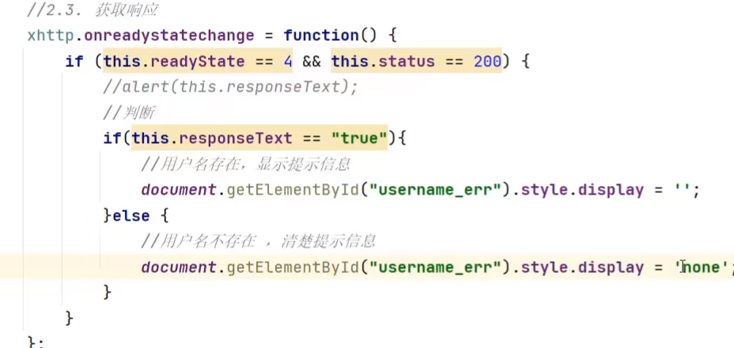


逻辑：

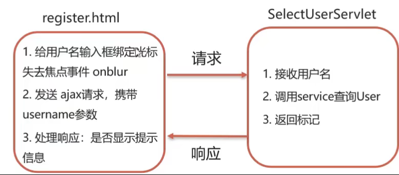

### Axios异步框架

作用：对原生Ajax进行封装，简化书写

下载官网：[Axios ](https://axios-http.com/)

1. 引入axios的js文件

   ```html
   <script src="js/axios-0.18.0.js"></script>
   ```

2. 使用axios发送请求，并获取响应结果

   ```javascript
   axios({
       method:"get",
       url:"http://localhost:8080/ajax-demo/aJAX?username=chunshi"
    // data:"?username=chunshi"
   }).then(function(resp){
       alert(resp.data);
   })
   ```
   
   注意：如果是post请求，携带的参数放在data变量中

### Axios请求方式别名

为了方便起见，Axios已经为所有支持的请求方式提供了别名

**主要方法**

发送`get`请求

```javascript
axios.get("url").then(function(resp){
    alert("resp.data");
});
```

发送`post`请求

```javascript
axios.post("url","参数").then(function(resp){
    alert(resp.data);
});
```

### JSON

JavaScript对象表示法。由于其语法简单，层次结构鲜明，现多用于作为**数据载体**，在网络中进行数据传输。

**基础语法**

```json
var json={
    "name":"chunshi",
    "age":23,
    "addr":["北京","上海","西安"]
};
// 获取数据 变量名.key
json.name
```

**Json数据和Java对象的转换**

客户端和服务端之间的数据传输是通过JSON来完成的，这其中涉及到son数据和Java对象的转换。

请求数据：JSON数据转为Java对象

响应数据：Java对象转化为JSON数据

**`Fastjson`**

`Fastjson`是阿里巴巴提供的一个Java语言编写的高性能，功能完善的JSON库，是目前Java语言中最快的JSON库，可以实现Java对象和JSON字符串的相互转换

- 导入Maven依赖

```xml
<dependency>
    <groupId>com.alibaba</groupId>
    <artifactId>fastjson</artifactId>
    <version>1.2.62</version>
</dependency>
```

- 将Java对象转换为JSON

```java
String jsonStr = JSON.toJSONString(obj);
```

- 将JSON字符串转为Java对象

```java
User user = JSON.parseObject(jsonStr,User.class);
```


