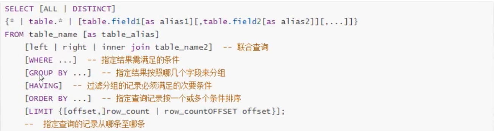
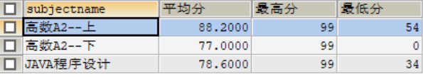
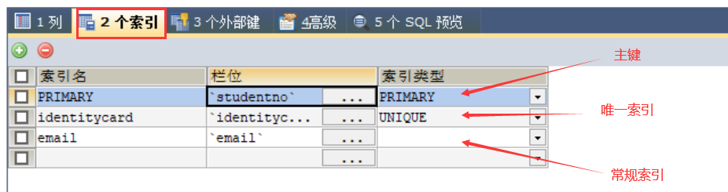

# MySQL

## 基本概念

数据库：`DateBase`，简称`DB`

数据库管理系统： `DataBaseManagementSystem`，简称`DBMS`

**`SQL`**：结构化查询语言

三者之间的关系： `DBMS--执行-->SQL--操作--> DB`

**`SQL`语句分类**

**`DQL`：** 数据查询语言（凡是带有`select`关键字的都是查询语句） `select...`

**`DML`：** 数据操作语言（凡是对表当中的数据进行增删改的都是`DML`） `insert delete update insert 增 delete 删 update 改`。这个主要是操作表中的数据data。

**`DDL`：** 数据定义语言 凡是带有`create、drop、alter`的都是`DDL`。 `DDL`主要操作的是表的结构。不是表中的数据。` create：新建，等同于增 drop：删除 alter：修改 `，这个增删改和`DML`不同，这个主要是对**表结构**进行操作。

**`TCL`：** 事务控制语言。包括：事务提交：`commit `事务回滚：`rollback`;

**`DCL`：** 数据控制语言。 例如：授权`grant`、撤销权限`revoke....`

常见的数据库管理系统：` MySQL、Oracle、MS SqlServer、DB2、sybase`等....

**重置密码**

```mysql
#进入MySQL
mysql>
#修改加密规则
ALTER USER 'root'@'localhost' IDENTIFIED BY 'password' PASSWORD EXPIRE NEVER; 
#更新用户的密码
ALTER USER 'root'@'localhost' IDENTIFIED WITH mysql_native_password BY 'password'; 
#刷新权限
FLUSH PRIVILEGES;
#重置密码
ALTER USER 'root'@'localhost' IDENTIFIED BY '123456';
```

**`MySQL`的关闭和启动**

```shell
net start mysql80
net stop mysql80
# 登录Mysql
mysql -uroot -p123456
```

## sqlyog的使用

**创建数据库**


**修改配置**


注意：如果`MySQL`的版本≥5.5.3，可以把字符编码设置为`utf8mb4`。`utf8mb4`和`utf8`完全兼容，但它支持最新的`Unicode`标准，可以显示emoji字符。

**建表**


## 数据库操作

==注意：MySQL关键字不区分大小写==

**基本的增删改查**

```mysql
-- 创建数据库,并设置字符集编码
CREATE DATABASE [IF NOT EXISTS] `test` [CHARACTER SET utf8 COLLATE utf8_general_ci];
-- 删除数据库
DROP DATABASE IF EXISTS `test`
-- 使用数据库
USE `test`
-- 查看所有的数据库
SHOW DATABASES
```

`Tips:`如果变量名跟关键字相同或是一些特殊字符，需要用``引起来。

**其他操作**

```mysql
# 命令行窗口中常用
select version(); 查看mysql数据库的版本号  
select database();  查看当前使用的哪个数据库
\c 用来终止一条命令的输入
\q或exit 退出mysql
```

## 字段基本数据类型


> 数值类型

| 变量名称  | 含义                                 | 大小    |
| --------- | ------------------------------------ | ------- |
| tinyint   | 十分小的数据                         | 1个字节 |
| smallint  | 较小的数据                           | 2个字节 |
| mediumint | 中等大小的数据                       | 3个字节 |
| $int$     | 整数类型                             | 4个字节 |
| bigint    | 较大的数据                           | 8个字节 |
| float     | 浮点数                               | 4个字节 |
| $doubt$   | 浮点数                               | 8个字节 |
| $decimal$ | 字符串形式的浮点数，在金融计算时使用 | 无      |

> 字符串

| 变量名称  | 含义                                                         | 大小       |
| --------- | ------------------------------------------------------------ | ---------- |
| char      | 固定大小的字符                                               | $0-255$    |
| $varchar$ | 可变长度字符串,相当于`String`                                | 不限       |
| tinytext  | 微型文本，可用于写博客                                       | $2^8-1$    |
| test      | 文本串,保存大文本                                            | $2^{16}-1$ |
| clob      | 字符串大对象，最多可以储存`4G`的字符串。比如：文章，说明     |            |
| blob      | 二进制大对象，专门用来储存图片，声音，视频等流媒体数据。插入数据的时候，需要使用IO流。 |            |

> 时间日期

| 变量名称    | 含义                                  |
| ----------- | ------------------------------------- |
| data        | 日期，格式：`yyyy-MM-dd`              |
| time        | 时间，格式：`HH:mm:ss`                |
| $datatime$  | 时间日期，格式：`yyyy-MM-dd HH:mm:ss` |
| $timestamp$ | 时间戳，1970.1.1到现在的毫秒数        |
| year        | 表示年份                              |

`Tips`：`MM`大写是为了区分“月”与“分”，`HH`大写是为了区分12小时制。

> $(Null)$ 

空值，代表未知。尽量不要使用 $Null$ 进行运算。 $Null$ 运算的结果也是 $Null$ 。

## 表的字段属性【重点】

> Unsigned

无符号的整数，不能声明为负数。

> zerofill

不足的位数用 $0$ 填充。

> 自增

- 自动在上一条记录的基础上加一
- 通常用来设计唯一的逐渐`index`，必须是整数类型
- 可以自定义设计主键自增的起始值和步长(高级设置)

> 非空

如果不填值，默认为 $Null$ 。勾选非空的话不赋值就会报错。==主键必须非空==

> 长度

**int**的长度指的是最大显示宽度，最大有效显示宽度是 $255$ 。显示宽度与存储大小或类型包含的值的范围无关。

**varchar**的长度即是字符的数量。

【了解】正式创建表时，必须存在以下五个字段。未来做项目时表示一个记录存在的意义

```mysql
id   主键
`version`  乐观锁
is_delete  伪删除
gmt_create  创建时间
gmt_update  修改时间
```

## 表操作 

数据库中最基本的操作单元是表，在数据库中以表的形式存储数据。

行`(row)`：被称为数据/记录

列`(column)`：被称为==字段==

**创建表`create`**

```mysql
CREATE TABLE IF NOT EXISTS `studentINFO` (
    `id` INT(4) NOT NULL AUTO_INCREMENT COMMENT '学号',
    `name` VARCHAR(30) NOT NULL DEFAULT '匿名' COMMENT '姓名',
    `pwd` VARCHAR(20) NOT NULL DEFAULT '123456' COMMENT '密码',
    `sex` VARCHAR(2) NOT NULL DEFAULT '女' COMMENT '性别',
    `birthday` DATE DEFAULT NULL COMMENT '出生日期',
    `address` VARCHAR(100) DEFAULT NULL COMMENT '地址',
    `email` VARCHAR(50) DEFAULT NULL COMMENT '邮箱',
    PRIMARY KEY(`id`)
)ENGINE=INNODB DEFAULT CHARSET=utf8;
```

`Tips:`

- 表的名称和字段名最好使用``括起来，防止与关键字重复

- 字符串使用单引号`‘’`括起来
- 所有的语句后面加`,`，最后一个不用加
- `AUTO_INCREMENT`自增
- `PRIMARY KEY`主键，习惯放在最后声明，一般一个表只有唯一一个主键。

模板：

```mysql
CREATE TABLE [IF NOT EXISTS] `表名` (
    `字段名` [列类型] [属性] [索引] [注释],
    `字段名` [列类型] [属性] [索引] [注释],
    ......
    `字段名` [列类型] [属性] [索引] [注释]
)[引擎][字符集设置][注释];
```

==常用查询源码的语句==

```mysql
SHOW CREATE DATABASE school    -- 查看创建数据库的语句
SHOW CREATE TABLE studentINFO    -- 查看studentINFO数据表的定义语句
DESC studentINFO     -- 只显示表的结构，不显示表中的数据
```

使用`SQL`语句创建表太过于麻烦。在以后的工作中我们可以使用工具创建表之后，使用上面的语句获取创建表的源码。

**【了解】MySQL两种引擎比较**

- `INNODB`   默认使用
- `MYISAM`   早些年使用

对比：

|            | `MYISAM` | `INNODB`               |
| ---------- | -------- | ---------------------- |
| 事务支持   | 不支持   | 支持                   |
| 数据行锁定 | 不支持   | 支持                   |
| 外键约束   | 不支持   | 支持                   |
| 全文索引   | 支持     | 不支持                 |
| 表空间大小 | 较小     | 较大，约为MYISAM的两倍 |

结论：

- `MYISAM`节约空间，速度较快
- `INNODB`安全性高，事务的处理，多表用户操作

**两者在物理空间上存在的位置**

<u>所有数据库的文件都存储在data目录下，因此数据库的本质还是文件的存储。</u>

MySQL引擎在物理空间上的区别：

- `INNODB`在数据库表中只有一个`*.frm`文件，以及上级目录下的 `ibdata1` 文件
- `MYISAM` 对应文件：
  - `*.frm` -> 表结构的定义文件
  - `*.MYD*` -> 数据文件`(data)`
  - `*.MYI*` -> 索引文件`(index)`

**设置表的字符集编码**

```mysql
CHARSET=utf8
```

如果不设置的话，默认的是`MySQL`的字符集编码`Latin1`(不支持中文)。

也可以在`my.ini`文件中配置默认的编码，但尽量养成在创建表时设置编码的习惯。

`my.ini`

```ini
[mysqld]
basedir=D:\MySQL\
datadir=D:\MySQL\data\
port=3306
#skip-grant-tables、
character-set-server=utf8  
```

**修改表`alter`**

```mysql
-- 修改表名: ALTER TABLE <旧表名> RENAME AS <新表名>
ALTER TABLE student RENAME AS student1
-- 增加表的字段：ALTER TABLE <表名> ADD <字段名> <列属性>
ALTER TABLE student1 ADD age INT(11)
-- 修改表的字段(修改约束):ALTER TABLE 表名<> MODIFY <字段名> <列类型>
ALTER TABLE student MODIFY age varchar(10)
-- 修改表的字段(重命名,修改约束)：ALTER TABLE 表名<> MODIFY <旧字段名> <新字段名> <列类型>
ALTER TABLE student CHANGE age age1 INT(1)
-- 删除表的字段：ALTER TABLE <表名> DROP <字段名>
ALTER TABLE student DROP age
```

**`change`和`modify`的区别**

`modify`只能用来修改字段的约束，`change`可以用来修改字段名和约束。

但使用`change`修改字段类型和约束时，要加上新字段名，新字段名可以和原来一样。

**删除表`drop`**

```mysql
DROP TABLE IF EXISTS `grade`
```

## 外键【了解】

定义：通过某些特殊的字段，把把一个表的数据与另一张表关联起来，这种列称为`外键`。

设置外键的条件：

- 设为外键的字段在从表中不能为主键
- 设为外键的字段必须在主表中为主键，即一个表的外键=另一个表的主键
- 两个字段必须具有相同的数据类型和约束

两种方式创建外键：

假设存在两个表，年级表（主表）和学生表（从表），学生表的`gradeid`字段引用年级表的 `gradeid`

- 创建表时绑定外键

  ```mysql
  CREATE TABLE `student` (
    `id` INT NOT NULL AUTO_INCREMENT COMMENT '学号',
    `name` VARCHAR(3) NOT NULL DEFAULT '匿名' COMMENT '姓名',
    `pwd` VARCHAR(20) NOT NULL DEFAULT '123456' COMMENT '密码',
    `sex` VARCHAR(2) NOT NULL DEFAULT '女' COMMENT '性别',
    `birthday` DATE DEFAULT NULL COMMENT '出生日期',
    `gradeid` INT(10) NOT NULL COMMENT '学生年级',
    `address` VARCHAR(10) DEFAULT NULL COMMENT '地址',
    `email` VARCHAR(5) DEFAULT NULL COMMENT '邮箱',
    PRIMARY KEY (`id`),
    KEY `FK_gradeid`(`gradeid`),  -- 定义外键key
    CONSTRAINT `FK_gradeid` FOREIGN KEY (`gradeid`) REFERENCES `grade`(`gradeid`)  -- 给这个外键添加约束
  ) ENGINE=INNODB DEFAULT CHARSET=utf8
  ```
  
- 已完成的表绑定外键

  ```mysql
  -- 创建表的时候没有外键关系
  ALTER TABLE `student` ADD CONSTRAINT `FK_gradeid` FOREIGN KEY(`gradeid`) REFERENCES `grade`(`gradeid`)
  -- 格式：ALTER TABLE <表名> ADD CONSTRAINT <约束名> FOREIGN KEY(<作为外键的列>) REFERENCES <关联表> (<字段名>)
  ```

完成后有如下显示，就表明外键绑定成功：


删除有外键关系的表的时候，必须要先删除应用别人的从表，再删除被应用的主表。

注意：以上的操作都是物理外键，数据库级别的外键，不建议使用！

阿里的JAVA规范中有下面一条：

> 不得使用外键与级联，一切外键概念必须在应用层解决。 

给出的原因是：

> 每次做DELETE和UPDATE都必须考虑外键约束，会导致开发的时候很痛苦，测试数据极不方便。

最佳实践：数据库只用来存储数据，想使用外键的话在应用层用程序实现。

## `DML`数据操作语言

上面我们学习的语言主要是操作表结构的`DDL`(数据定义语言)，而`DML`主要是操作数据的语言。

**插入数据`insert`**

```mysql
-- 格式：insert into 表名([字段名1，字段名2，字段名3...]) value('值1','值2','值3'...)

-- 插入单个字段，其他字段不赋值默认为null
INSERT INTO `studentinfo`(`name`) VALUES('张三')
-- 插入多个字段，字段和值要一一对应
INSERT INTO `studentINFO`(`id`,`name`,`pwd`,`sex`,`birthday`) VALUES('3','小Wang','12345','男','2xxx-0x-xx')
-- 插入多条数据，值用逗号隔开即可
INSERT INTO `studentINFO`(`id`,`name`,`pwd`,`sex`,`birthday`) VALUES('6','小Wang','12345','男','2xxx-0x-xx'),
('7','小hu','aaaaa','女','2xxx-0x-xx')
```

注意：

- 由于主键自增，插入时我们可以省略

- 插入多个字段时，字段和值要一一对应。如果不写表的字段，他就会==按顺序将字段和值一一匹配==。
  即`id--3,name--张三,pwd--12345...`。

**修改数据`update`**

```mysql
-- 格式：UPDATE <表名> SET 字段名=value WHERE 条件

-- 修改单个字段
UPDATE student SET `birthday`=CURRENT_TIME WHERE id=1
-- 修改多个字段
UPDATE student SET `name`='wang',`address`='山东' WHERE id=1
```

==注意==：如果没有条件限制会导致所有数据全部更新 。

有关`where`语句的知识点在后面。

- `value`可以是一个值也可以是一个变量，`CURRENT_TIME`，`SYSDATE()`,`CURRENT_TIMESTAMP()`都可以获取到当前时间。

**删除数据**

- **`delete`**，删除表中的数据

格式：`delete from 表名 where 条件`；

```mysql
DELETE FROM `student` WHERE id=3
```

==注意==：没有`where`条件，整张表的数据都会删除（从入门到删库跑路）

- **`truncate`**，删除整个表的数据

```mysql
TRUNCATE `student`
```

两者的区别：

相同点：只能删除表的数据，不能删除表的结构，表的索引约束不会变。

不同点：

- 分类上：`delete`属于`DML`语句，`truncate`属于`DDL`语句
- 功能上：`delete`主要用于删除表中的数据；`truncate`主要用于删除整张表。
- 效果上：`truncate`重新设置自增列，计数器归零，`delete`则不会影响计数器；`truncate`不会影响事务。
- 原理上：`delete`删除表中的数据，但这个数据在硬盘上的真实存储空间不会释放；而`truncate`是物理删除，干净利落。
- 效率上：`delete`删除效率较低，`truncate`效率高。
- 其他：`delete`支持回滚，`truncate`则不支持。

【了解】`delete`删除问题：重启数据库两种引擎的现象

- `INNODB` 自增列会从1开始（数据存储在内存中，断电即失）
- `MYISAM`：继续从上一个自增量开始（数据存储在文件中，不会丢失）

## `DQL`数据查询语言==【重点】==

`select`语句语法：



其中`[]`表示可选，`{}`表示必选；

`select`语句的==执行顺序==：`from->on->join->where->group by->having->select->distinct->order by->limit`

### 简单查询

```mysql
-- 查询表的全部字段
SELECT * FROM `result`
-- 查询指定字段
SELECT `studentno`,`sex`,`phone` FROM student
-- 列起别名 可以给字段起别名也可以给表起别名
SELECT `sex` AS 性别,`phone` AS 电话 FROM student AS s
-- Concat(a,b)拼接函数
SELECT CONCAT('姓名：',`studentno`) AS 新名字 FROM student
-- 查询的数据可以为表达式
SELECT `studentresult`+100 AS '提分后' FROM result
```

注意：`as`可以省略，别名不能有空格或中文，否则要将别名用引号括起来。

**去重`distinct`**

```mysql
SELECT DISTINCT `studentno` FROM `result`
```

**其他语句**

```mysql
SELECT VERSION()  -- 查询系统版本（函数）
SELECT 100*3-25 AS result -- 用于计算（表达式）
SELECT @@auto_increment_increment -- 查询自增的步长（变量）
```

### 条件查询

#### `where`语句

关键字

- 逻辑运算符：`and`，`or`或`&&`,`||`都可以表示逻辑与/或。

- 比较运算符：
  - `between a  and  b  `， 相当于`>=a and <=b`。
  - `!=`或`<>`表示不等于。

[尽量使用英文字母]

```mysql
-- 格式：select 字段名 from 表名 where 条件
SELECT `studentno`,`studentresult` FROM result WHERE `studentresult`>=80
SELECT `studentno` FROM result WHERE `studentno` IN (1002,1003)
```

### 模糊查询

- `null`不能使用=来衡量，`is null`表示为空，`is not null`表示不为空
- `not/!`都可以表示逻辑非。
- `in` 包括，相当于多个`or`，`not in` 不包括。in查询的内容是具体的一个值，不能使用 $\%$ 或 $\_$ 。

- `like` 称为模糊查询，支持%或下划线匹配==[重点]==
  - 百分号 $\%$ 匹配任意个字符
  - 下划线 $\_$ ，一个下划线只匹配一个字符

```mysql
-- 找出姓王的同学~
SELECT `studentname`,`sex`,`address` FROM student WHERE `studentname` LIKE '王%'
SELECT `studentname`,`sex`,`address` FROM student WHERE `studentname` LIKE '王__'
-- 找出名字中有“_”的：使用转义字符
SELECT `studentname` FROM student WHERE `studentname` LIKE '%\_%'
-- 找出地址是河南跟山东的
SELECT `studentname`,`address` FROM student WHERE `address` IN ('河南','山东')
-- 找出值为空的学生
SELECT `studentname`,`address` FROM student WHERE `address` IS NULL
```

### 联表查询【难点】

联表查询也称为连接查询，是多表查询的一种方式：

7种联表方式：


**关键字**

- `inner join`：返回两个表中都存在的行。
- `left join`：以左表为主表，会返回左表中所有的行。如果某些行仅在左表存在，那么剩下的字段以 $Null$ 填充。
- `right join`：以右表为主表，会返回右表中所有的行。如果某些行仅在右表存在，那么剩下的字段以 $Null$ 填充。

通俗理解，`inner join`表示并集，`left join`表示红色的圆圈，`right join`表示蓝色圆圈。


```mysql
-- inner join
SELECT s.`studentno`,`studentname`,`subjectno`,`studentresult` 
FROM student s
INNER JOIN result r
ON s.studentno = r.studentno  -- 确定交叉点（两个表中相同的数据）
```

**总结**

- 使用联表查询时，先确定主表，然后将另一张表的数据附加到主表上。
- 查询两个表都有的字段时需要表明是哪个表的数据，不然会报错`ambiguous`。

- 当两个表中的数据在另一个表中都能找到时，三个关键字查询结果相同。

**应用**

假设存在一张学生表和一张成绩表（两张表数据不对等），我们需要找出其中缺考的学生。

两张表如下：


找出其中缺考的学生：

```mysql
SELECT s.`studentno`,`studentname`,`subjectno`,`studentresult` 
FROM student s
LEFT JOIN result r
ON s.studentno = r.studentno
WHERE studentresult IS NULL
```

查询结果：


如果采用`inner join`或`right join`的结果是将会是空表。

**多表查询**

```mysql
/*查询参加考试的学生信息：学号，学生姓名，科目名，分数
思路：
1.分析需求，找出需要的表
2.确定使用那种连接查询
3.确定交叉点：student与result的studentno相同，result与subject的subjectno相同
*/
SELECT s.`studentno`,`studentname`,`subjectname`,`studentresult` 
FROM student s
INNER JOIN result r
ON s.studentno = r.studentno
LEFT JOIN `subject` sub   -- 先查询两张表在依次添加
ON r.subjectno=sub.subjectno
```

### 自连接【了解】

简单来说，自连接就是将一张“特殊”的表拆成两张表。

如图有一张树形分类表：


其中`pid`表示父id，`pid=1`表示顶级id。`pid>1`的与顶级id是**从属关系**。

那么这张表可以转化为两张表：


那么父类跟子类的对应关系是：


获取父类跟子类对应关系的表，操作为：

```mysql
SELECT a.`categoryName`,b.`categoryName` 
FROM `category` a,`category` b 
WHERE a.`categoryid`=b.`pid`
```

### 分页和排序

#### 排序 

关键词：`order by`

例如，将学生按成绩高低排序：

```mysql
SELECT s.`studentno`,`studentname`,`studentresult` 
FROM student s
INNER JOIN result r
ON s.studentno = r.studentno
ORDER BY studentresult DESC
```

`DESC`表示降序，`ASC`表示升序（默认）。

查询结果：


#### 分页

分页的原因？

- 缓解数据库压力
- 给阅览者更好的体验

浏览器网页显示数据还有另一种方式：瀑布流。即内容随着下拉操作加载，导航条随之伸展。

例如：找出排名前五的学生：

```mysql
SELECT s.`studentno`,`studentname`,`subjectno`,`studentresult` 
FROM student s
INNER JOIN result r
ON s.studentno = r.studentno
WHERE `subjectno`=2
ORDER BY studentresult DESC
LIMIT 0,5
```

查询结果：


`limit`语法：`limit 起始值,页面大小`

起始值代表开始数据的下标索引；

页面大小代表一页显示数据的多少；

规律：第 $N$ 页：`limit (n-1) * PageSize,Pagesize`

## 子查询和嵌套查询

```mysql
-- 查询 JAVA程序设计的所有考试结果 （学号，科目标号，成绩），降序排列
-- 方式1：联表查询
SELECT r.studentno,r.`subjectno`,`studentresult` 
FROM result r
INNER JOIN `subject` sub
ON r.`subjectno` = sub.subjectno
WHERE subjectname = 'JAVA程序设计'
ORDER BY `studentresult` DESC

-- 方式二：子查询
SELECT studentno,`subjectno`,`studentresult` 
FROM result
WHERE subjectno = (
SELECT subjectno FROM `subject`
WHERE subjectname = 'JAVA程序设计'
)
ORDER BY `studentresult` DESC


-- 查询高数A2--上 课程成绩排名前三的学生 并且分数大于80的学生信息（学号，姓名，分数）
-- 联表查询与子查询结合
SELECT s.`studentno`,`studentname`,`studentresult`    -- 查询字段中包含两个表中的字段
FROM student s
INNER JOIN `result` r
ON s.`studentno` = r.`studentno`
WHERE `subjectno` = (SELECT `subjectno` FROM `subject` WHERE `subjectName` = '高数A2--上')
ORDER BY `studentresult` DESC
LIMIT 0,3

-- 查询 高数A2--上 成绩不低于80的学生的信息（学号，姓名）
-- 嵌套查询：子查询中再嵌套子查询
SELECT `studentno`,`studentname` 
FROM `student` 
WHERE `studentno` IN (
SELECT `studentno` FROM `result` 
WHERE `studentno` >=80
AND `subjectno` = (SELECT `subjectno` FROM `subject` WHERE `subjectname`='高数A2--上')
)

-- 查询高数A2--下 前5名的学生的成绩信息（学号，姓名，分数）
SELECT s.`studentno`,`studentname`,`studentresult` 
FROM student s
INNER JOIN `result` r
WHERE `subjectno` = (SELECT `subjectno` FROM `subject` WHERE `subjectname` = '高数A2--下')
ORDER BY `studentresult` DESC
LIMIT 0,5
```

- 使用子查询时，必须保证需要查询的字段为同一个表（父表）中的字段。

- 子查询查询的子表必须与父表有相同的字段。

个人理解：子查询本质就是利用其他跟父表有相同字段表，中的其他字段作为`where`语句的判断条件。

## MySQL函数

### 常用函数【了解】

```mysql
-- 数值函数
SELECT ABS(-8)  -- 绝对值函数
SELECT CEILING(9.4)  -- 向上取整
SELECT FLOOR(9.4)   -- 向下取整
SELECT RAND()  -- 返回0~1之间的随机数
SELECT SIGN(10)   -- 判断一个数的符号 0返回0 负数返回-1  返回1

-- 字符串函数
SELECT CHAR_LENGTH('我爱学习 学习爱我')  -- 返回字符串长度
SELECT CONCAT() -- 拼接字符串
SELECT INSERT() -- 查询是否含有某个字符
SELECT REPLACE() -- 替换出现的字符串
SELECT SUBSTR() -- 切割字符串

-- 时间和日期函数（重要）
SELECT CURRENT_DATE() -- 获取当前日期
SELECT CURDATE()  -- 获取当前时间
SELECT NOW()  -- 获取当前时间
SELECT LOCALTIME()  -- 获取本地时间
SELECT SYSDATE()  -- 系统时间

SELECT YEAR(NOW())  -- 获取年份
SELECT MONTH(NOW())  -- 获取月份
SELECT DAY(NOW())  -- 获取日期
SELECT HOUR(NOW())  -- 获取小时数
SELECT MINUTE(NOW())  -- 获取分数
SELECT SECOND(NOW())  -- 获取秒数
```

### 聚合函数【重点】

```mysql
-- 查询函数
SELECT COUNT(`studentno`) FROM student  -- 查询行数，会所有的忽略Null值
SELECT COUNT(*) FROM student  -- 不会忽略Null值
SELECT COUNT(1) FROM student   -- 不会忽略Null值，与COUNT(*)没有什么太大的区别

SELECT SUM(`studentresult`) AS 总和 FROM result
SELECT AVG(`studentresult`) AS 平均分 FROM result
SELECT MAX(`studentresult`) AS 最高分 FROM result
SELECT MIN(`studentresult`) AS 最低分 FROM result
```

## 分组过滤

关键字：

- `group by`：分组依据
- `having`：过滤，相当于`where`。但`group by`只能与`having`连用。

如图有一张学科表，[成绩表](#联表查询【难点】)在上面：


```mysql
-- 查询不同课程的平均分，最高分，最低分，平均分大于80
-- 分组原理：根据不同的课程分组
SELECT subjectname,AVG(`studentresult`) AS 平均分,MAX(`studentresult`) AS 最高分,
MIN(`studentresult`) AS 最低分
FROM result r
INNER JOIN `subject` sub
ON r.`subjectno` = sub.`subjectno`
GROUP BY r.`subjectno`
HAVING 平均分>60

-- 不分组
SELECT subjectname,AVG(`studentresult`) AS 平均分,MAX(`studentresult`) AS 最高分,
MIN(`studentresult`) AS 最低分
FROM result r
INNER JOIN `subject` sub
ON r.`subjectno` = sub.`subjectno`
```

不分组：

​	

不分组会将所有的成绩都分为一类，因此最高分和最低分为全部成绩的最高分和最低分。

分组后：

​	

分组后将不同成绩归为不同的学科，每组都有最高分和最低分。

$Tips:$ `group by`还可以用于多表查询中去重。

## MD5加密【了解】

对于数据库中的数据，如果我们不想让他显式的表现出来，我们可以使用一些办法加密。

```mysql
CREATE TABLE `testmd5`(
    `id` INT(4) NOT NULL,
    `name` VARCHAR(20) NOT NULL,
    `pwd` VARCHAR(50) NOT NULL,
    PRIMARY KEY(`id`)
)ENGINE=INNODB DEFAULT CHARSET=utf8
-- 明文密码
INSERT INTO `testmd5` VALUE(1,'zhangsan','123456'),(2,'lisi','123456')
-- 加密
UPDATE `testmd5` SET pwd=MD5(pwd) WHERE id=1
-- 插入的时候加密
INSERT INTO `testmd5` VALUE(3,'xiaowang',MD5('123456'))
-- 判断用户输入的密码是否正确
SELECT `id`,`name` FROM `testmd5` WHERE `pwd`=MD5('123456')
```

加密后的内容：

​	

## 事务

假设A给B转钱 ，转钱之前：A：1000    B：200

SQL1执行：A转给B200   A-200

SQL2执行：B收到A转的钱   B+200

如果两个SQL语句中间出现错误，那么就会导致数据问题

解决方法：将一组SQL语句放在一个事务中执行

==要么都成功，要么都失败==

### ACID原则

[参考博客](https://blog.csdn.net/dengjili/article/details/82468576)

即事务原则。主要分为一下几种特性：

**原子性（Atomicity）**

要么都成功，要么都失败。

**一致性（Consistency）**

事务前后的数据完整性保持一致。

例如A与B之间转钱，总钱数1200不变。

**持久性（Durability）**

表示事务结束后的数据不随着外界原因导致数据丢失。

即事务一旦提交就不可逆，被持久化到数据库中（以文件保存）。

事务没有提交，可以恢复到原状态。

**隔离性（Isolation）**

事务的隔离性是多个用户并发访问数据库时，数据库为每一个用户开启的事务，不能被其他事务的操作数据所干扰，即事务之间要相互隔离。

> 隔离所导致的一些问题

**脏读**

指一个事务读取了另外一个事务未提交的数据。

**不可重复读**

在一个事务内读取表中的某一行数据，多次读取的结果不同。（这个不一定是错误，只是某些场合不对）

**虚读(幻读)**

是指在一个事务内读取到了别的事务插入的数据，导致前后读取不一致。

> 事务三要素

- 执行
- 提交
- 回滚

**格式**

```mysql
-- mysql默认开启事务自动提交，我们要手动将它关闭
-- 关闭事务自动提交
SET autocommit = 0   -- 关闭
SET autocommit = 1   -- 开启

-- 我们需要手动处理事务，所以要将自动提交关闭

-- 开启事务
START TRANSACTION   -- 标记一个事务的开始，之后的sql都在同一个事务内

SQL1
SQL2

-- 之后提交事务，持久化到数据库中
COMMIT
-- 或者回滚
ROLLBACK

-- 事务结束,开启自动提交
SET autocommit = 1  

-- 了解
SAVEPOINT 保存点名   -- 设置事务的保存点
ROLLBACK TO SAVEPOINT 保存点名  -- 回滚到保存点
RELEASE SAVEPOINT 保存点名  -- 撤销保存点
```

**流程**


**测试事务**

```mysql
CREATE DATABASE bank CHARACTER SET utf8 COLLATE utf8_general_ci
USE bank

CREATE TABLE `account`(
   `id` INT(3) NOT NULL AUTO_INCREMENT,
   `name` VARCHAR(30) NOT NULL,
   `money` DECIMAL(9,2) NOT NULL,
   PRIMARY KEY(`id`)
)ENGINE=INNODB DEFAULT CHARSET=utf8

INSERT INTO account(`name`,`money`) 
VALUE('A',2000.00),('B',10000.00)

-- 模拟事务：转账
SET autocommit = 0;
-- 开启事务
START TRANSACTION

UPDATE account SET money=money-500 WHERE `name` = 'A'
UPDATE account SET money=money+500 WHERE `name` = 'B'

-- 提交事务
COMMIT
-- 回滚
ROLLBACK

-- 开启自动提交
SET autocommit = 1
```

- 事务没提交时，使用回滚会回到开始状态，但事务并不会结束。
- 事务提交后，再使用回滚无效。

还有事务引发的几种问题，可以了解一下[MySQL事务及事务引发的问题](https://blog.csdn.net/weixin_44337261/article/details/108891730)

## 索引

> 索引（index）是帮助MySQL高效获取数据的**数据结构**。     —– MySQL官方

### 索引的分类

- 主键索引（PRINARY KEY）
  - 唯一的标识，主键不可重复，只能有一个列作为主键
- 唯一索引（UNIQUE KEY）
  - 避免重复出现，唯一索引可以重复，多个列都可以标识为唯一索引
- 常规索引（KEY/INDEX）
  - 默认索引
- 全文索引（FULLTEXT）
  - 在特定的数据库引擎下才有：`MyISAM`
  - 用于快速定位数据

在一个表中，主键索引只能有一个，唯一索引可以有多个。



### 索引的使用

- 在创建表的时候添加索引
- 创建表之后添加索引


### 索引原则

- 索引不是越多越好
- 不要对进程变动的数据加索引
- 小数据量的表必须要加索引
- 索引一般加在常用来查询的字段上

### 索引的数据结构

- Hash类型的索引
- Btree：InnoDB的默认使用的数据结构

参考博客：[ MySQL索引背后的数据结构及算法原理](https://blog.codinglabs.org/articles/theory-of-mysql-index.html)==【重要】==

## 数据库用户管理

在`root`用户下的`mysql`数据库中的`user`表中存放用户的信息。

**用`sqlyog`可视化工具操作**


设置用户权限


设置权限的目的：防止删库跑路。

> **代码实现**

```mysql
-- 创建用户  CREATE USER 用户名@主机名称 IDENTIFIED BY '密码'
CREATE USER hujingjing@localhost IDENTIFIED BY '123456'

-- 重置密码
ALTER USER 'hujingjing'@'localhost' IDENTIFIED BY '111111'

-- 旧版本修改密码（修改当前用户密码）
SET PASSWORD = PASSWORD('aaaaaa')

-- 旧版本修改密码（修改指定用户密码）
SET PASSWORD FOR hujingjing = PASSWORD('111111')

-- 用户授权:授予全部权限（ALL PRIVILEGES） 库.表  *是通配符
GRANT ALL PRIVILEGES ON *.* TO 'hujingjing'@'localhost'

-- 查询权限
SHOW GRANTS FOR hujingjing@localhost  -- 查看指定用户的权限

-- 撤销权限  撤销的权限，在哪个库撤销
REVOKE ALL PRIVILEGES ON *.* FROM hujingjing@localhost

-- 删除用户
DROP USER hujingjing@localhost
```

注意：

- `%`代表`localhost`，创建用户时不写`@...`默认为`@%`。主机名称为`%`可以忽略不写`@%`
- `ALL PRIVILEGES`不包括`GRANT`权限。`GRANT`权限：指能够给别人授权。


## MySQL备份

备份的作用

- 防止重要数据丢失
- 数据转移（导入导出）

MySQL备份方式

- 拷贝物理文件：MySQL目录下的data文件夹。这个文件夹保存着数据库的数据。

- 在`sqlyog`等可视化工具中导出

  

  

  

- 使用命令行**导出**

  关键字：`mysqldump`
  
  ```shell
  # 格式：mysqldump -h主机  -u用户名  -p密码   数据库  表名  >物理磁盘位置/文件名
  # 导出表
  >mysqldump -hlocalhost -uroot -p123456 school student >C:\Users\hujingjing\Desktop/a.sql
  # 导出多张表
  >mysqldump -hlocalhost -uroot -p123456 school student result subject >C:\Users\hujingjing\Desktop/b.sql
  # 导出数据库
  >mysqldump -hlocalhost -uroot -p123456 bank >C:\Users\hujingjing\Desktop/c.sql
  ```

  $Tips:$ `-h`参数默认是主机名称。如果主机是`localhost`可以默认不写。

  使用命令行**导入**
  
  ```mysql
  # 登录状态，切换到指定数据库后 格式：source 备份文件路径
  mysql>source C:/Users/hujingjing/desktop/b.sql
  # 未登录状态  格式：mysql -u用户名 -p密码 库名 <备份文件
  >mysql -uroot -p123456 bank<C:/Users/hujingjing/desktop/b.sql
  ```
  
  

