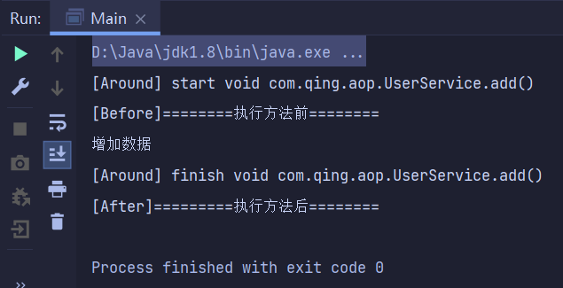

# Spring

**什么是Spring？**

> Spring是一个支持快速开发Java EE应用程序的**框架**。它提供了一系列底层容器和基础设施，并可以和大量常用的开源框架无缝集成，是开发Java EE应用程序的必备。

核心基础框架：**`Spring Framework`**。在`Spring Framework`基础上，又诞生了`Spring Boot`、`Spring Cloud`、`Spring Data`、`Spring Security`等一系列基于`Spring Framework`的项目。

**Rod Johnson**：`Spring Framework`创始人，悉尼大学博士，专业是音乐学。

弊端：发展太久之后，违背原来的理念，配置十分繁琐，后被称为“ 配置地狱 ”！

从官网[下载](https://repo.spring.io/ui/native/release/org/springframework/spring/)

从GitHub上[下载](https://github.com/spring-projects/spring-framework)

[官方文档(5.3.15)](https://docs.spring.io/spring-framework/docs/current/reference/html/core.html#beans-introduction)


**导入依赖**

```xml
<dependency>
    <groupId>org.springframework</groupId>
    <artifactId>spring-webmvc</artifactId>
    <version>5.2.0.RELEASE</version>
</dependency>
<dependency>
    <groupId>org.springframework</groupId>
    <artifactId>spring-jdbc</artifactId>
    <version>5.3.15</version>
</dependency>
```

`Tips:`只要导入`spring-webmvc`依赖，spring其他有关的jar包也能被导入

## IoC容器

IoC容器是Spring框架的核心内容，使用多种方式完美的实现了IoC。可以使用XML文件配置，也可以使用注解实现。

我们来看个例子：

假设我们有Dao层和service层。正常情况下，我们需要通过service层来调用Dao层

`UserDao.java`

```java
public interface UserDao {
    void getUser();  // 模拟操作数据库
}
```

`UserDaoImp.java`

```java
public class UserDaoImp implements UserDao{
    @Override
    public void getUser() {
        System.out.println("Hello Spring!");  
    }
}
```

`UserService.java`

```java
public interface UserService {
    void getDao();  // 调用Dao层
}
```

`UserServiceImp.java`

```java
public class UserServiceImp implements UserService{
    private final UserDao userDao = new UserDaoImp();
    @Override
    public void getDao() {
        userDao.getUser();  // 通过service层去调用Dao层
    }
}
```

`MyTest.java`

```java
public class MyTest {
    public static void main(String[] args) {
        // 用户实际上调用的是service层，不需要接触Dao层
        UserService userService = new UserServiceImp();
        userService.getDao();
    }
}
```

但是假设存在多个Dao层，当我们要调用不同的Dao层时，必须要修改`UserServiceImp.java`中的代码

```java
// MySqlDaoImp.java
public class MySqlDaoImp implements UserDao{
    @Override
    public void getUser() {
        System.out.println("Hello MySQL");
    }
}
// OracleDaoImp.java
public class OracleDaoImp implements UserDao{
    @Override
    public void getUser() {
        System.out.println("Hello Oracle");
    }
}
```

`UserServiceImp.java`

```java
public class UserServiceImp implements UserService{
    // private final UserDao userDao = new MysqlDaoImp();
    private final UserDao userDao = new OracleDaoImp();
    @Override
    public void getDao() {
        userDao.getUser();
    }
}
```

当需求变更时，我们必须修改底层代码，非常麻烦。改进之后：

`UserServiceImp.java`

```java
public class UserServiceImp implements UserService{
    private  UserDao userDao;
    // 利用set进行动态实现值的注入
    public void setUserDao(UserDao userDao) {
        this.userDao = userDao;
    }
    @Override
    public void getDao() {
        userDao.getUser();
    }
}
```

`MyTest.java`

```java
public class MyTest {
    public static void main(String[] args) {
        UserServiceImp userServiceImp = new UserServiceImp();
        userServiceImp.setUserDao(new MySqlIml());
        userServiceImp.getDao();
    }
}
```

在之前的业务中，用户的需要可能会影响我们原来的代码，我们需要根据用户的需求去修改代码，但如果程序代码量巨大，则修改一次的成本代价十分昂贵。

当我们使用`set`进行动态注入后：

- 在此之前，是程序主动创建对象，控制权在程序员手上；
- 使用了`set`注入后，程序不再具有主动性，而是变成了被动的接受对象。

这就是**控制反转**(IoC)。

控制反转是一种`设计思想`，DI(依赖注入)是实现IoC的一种`方法`。我们使用面向对象编程，对象的创建与对象间的依赖关系完全硬编码在程序中，对象的创建由程序自己控制，控制反转后将对象的创建转移给第三方，可以理解所谓控制翻转就是：`获取对象依赖的方式反转`

**Spring提供的容器又称为IoC容器**。

什么是容器？

容器是一种为某种特定组件的运行提供必要支持的一个`软件环境`。例如，Tomcat就是一个Servlet容器，它可以为Servlet的运行提供运行环境。使用容器运行组件，除了提供一个组件运行环境之外，容器还提供许多`底层服务`。如：Servlet容器底层实现了TCP连接，解析HTTP协议等非常复杂的服务。

Spring的核心就是提供了一个IoC容器。它可以管理所有轻量级的`JavaBean组件`，提供的底层服务包括`组件的生命周期管理、配置和组装服务、AOP支持`，以及建立在AOP基础上的`声明式事务服务`等。

## 装配Bean

我们需要编写一个特定的`application.xml`文件，来告诉IoC容器如何创建并组装Bean。

Spring容器是通过读取XML文件后使用**反射**完成Bean的创建的。

`XML`文件格式：

```xml
<?xml version="1.0" encoding="UTF-8"?>
<beans xmlns="http://www.springframework.org/schema/beans"
    xmlns:xsi="http://www.w3.org/2001/XMLSchema-instance"
    xsi:schemaLocation="http://www.springframework.org/schema/beans
        https://www.springframework.org/schema/beans/spring-beans.xsd">
    
</beans>
```

### 通过无参构造创建Bean

```xml
<bean id="user" class="com.qing.spring.User"/>
<!--需要注入属性-->
<bean id="user" class="com.qing.spring.User">
    <property name="name" value="hujingjing"></property>
</bean>
```

- 每个Bean都有**唯一**的`id`

  ==(注意)==这代表两个Bean：

  ```xml
  <bean id="user" class="com.qing.spring.User" />
  <bean id="user2" class="com.qing.spring.User"/>
  ```

- `property`设置Bean的属性，如果属性是另一个Bean时，需要使用`<property name="..." ref="...(id)">`注入另一个Bean。

- Bean的顺序不重要，Spring会根据依赖关系自动正确进行初始化

### 通过有参构造创建Bean

- 通过参数名来设置

  ```xml
  <bean id="user" class="com.qing.pojo.User">
      <constructor-arg name="name" value="hujingjing"/>
  </bean>
  ```

- 通过索引值设置(了解)

  ```xml
  <bean id="user" class="com.qing.spring.User">
      <constructor-arg index="0" value="hujingjing"/>
  </bean>
  ```

- 通过类型创建(不建议)

  ```xml
  <bean id="user" class="com.qing.spring.User">
      <constructor-arg type="java.lang.String" value="hujingjing"/>
  </bean>
  ```

### 创建IoC容器

```java
ApplicationContext context = new ClassPathXmlApplicationContext("application.xml");
```

当然配置文件可能不止一个，用逗号隔开即可。

当程序执行到这句话时，`会一次性创建容器中所有的Bean`。

创建IoC容器之后，我们就可以通过`context.getBean("user")`获取到我们在xml文件中创建的Bean了。

我们还可以通过Bean的类型获取它：

```java
User use = context.getBean(User.class);
```

Spring还提供另一种IoC容器叫`BeanFactory`，与`ApplicationContext`类似：

```java
BeanFactory factory = new XmlBeanFactory(new ClassPathResource("application.xml"));
MailService mailService = factory.getBean(MailService.class);
```

`BeanFactory`和`ApplicationContext`的区别在于，`BeanFactory`的实现是按需创建，即第一次获取Bean时才创建这个Bean，而`ApplicationContext`会一次性创建所有的Bean。

---

还是[上面的例子](#IoC容器)，我们换一种方式来写：

`MyTest.java`

```java
public class MyTest {
    public static void main(String[] args) {
        // 获取Spring容器
        ApplicationContext context = new ClassPathXmlApplicationContext("application.xml");
        // 获取容器中的对象
        UserServiceImp userServiceImp = (UserServiceImp) context.getBean("userServiceImp");
        userServiceImp.getDao();
    }
}
```

`application.xml`

```xml
<?xml version="1.0" encoding="UTF-8"?>
<beans xmlns="http://www.springframework.org/schema/beans"
       xmlns:xsi="http://www.w3.org/2001/XMLSchema-instance"
       xsi:schemaLocation="http://www.springframework.org/schema/beans http://www.springframework.org/schema/beans/spring-beans.xsd">
    <bean id="userServiceImp" class="com.qing.service.UserServiceImp">
        <property name="userDao" ref="mySqlIml"/>
    </bean>
    <!--注意接口不能装入容器-->
    <bean id="mySqlIml" class="com.qing.spring.MySqlIml"/>
</beans>
```

得到一样的结果，但是我们不再需要通过`new`来创建对象。

传统应用程序的对象由程序本身控制创建的，使用Spring后，对象是由Spring来创建的。程序本身不再创建对象，而是变成了被动的接受对象。

当我们用Spring来创建对象，并通过Spring设置对象的属性，这个过程同样是`控制反转`。

实现控制反转时，`IoC容器`先在初始化时读取文件，根据配置文件或注解创建对象存入容器中，程序使用时再从`IoC容器`中取出需要的对象。

就好比在一个餐厅，原来是来一个顾客点什么菜，餐厅接单后才开始做；现在确却是餐厅有什么菜先做好，等到顾客来的时候直接把菜端给他。

`Tips:`在Spring中，实现控制反转的是`IoC容器`，其实现的方法是`依赖注入`(DI)。依赖注入主要是通过`set`方法进行注入的，**因此如果缺少`set`方法时会直接报错**。

## Spring配置

### 别名

- 通过`alias`取别名

```xml
<alias name="userServiceImp" alias="serviceImp"
```

- 通过`name属性`取别名==【常用】==

```xml
<bean id="user" class="com.qing.service.UserServiceImp" name="ServiceImp,serviceImp2;serviceImp3">
```

通过name属性取别名，可以起多个，可以用`,`或`;`隔开。通过别名也可以获取Bean。

### import

一般用于团队开发使用，可以将多个配置文件导入合并为一个。

`application.xml`

```xml
<import resource="beans.xml"/>
<import resource="bean2.xml"/>
<import resource="bean3.xml"/>
```

`Tips:`其中相同的Bean会被合并

## 依赖注入

依赖：Bean对象的创建依赖于容器

注入：Bean对象中左右的属性都由容器来注入

### 构造器注入

即前面的[通过无参构造创建Bean](#通过无参构造创建Bean)和[通过有参构造创建Bean](#通过有参构造创建Bean)

### set注入【重点】

```xml
<bean id="address" class="com.qing.spring.Address">
    <property name="address" value="长沙"/>
</bean>
<bean id="student" class="com.qing.spring.Student">
<!--普通值注入-->
    <property name="name" value="hujingjing"/>
<!--Bean注入-->
    <property name="address" ref="address"/>
<!--数组注入-->
    <property name="books">
        <array>
            <value>红楼梦</value>
            <value>西游记</value>
            <value>水浒传</value>
        </array>
    </property>
<!--List注入-->
    <property name="hobby">
        <list>
            <value>npy</value>
            <value>敲代码</value>
            <value>打游戏</value>
        </list>
    </property>
<!--Map注入-->
    <property name="card">
        <map>
            <entry key="身份证" value="12345"/>
            <entry key="银行卡" value="99999"/>
        </map>
    </property>
<!--Set注入-->
    <property name="games">
        <set>
            <value>WZRY</value>
            <value>WDSJ</value>
            <value>GY</value>
        </set>
    </property>
<!--注入null值-->
    <property name="wife">
        <null/>
    </property>
<!--Properties注入-->
    <property name="info">
        <props>
            <prop key="driver">202101206</prop>
            <prop key="sex">男</prop>
            <prop key="username">root</prop>
        </props>
    </property>
</bean>
```

### 其他注入

#### p命名空间

使用p命名空间可以直接注入属性的值。p即`property`，本质上还是set注入，只不过写法变得更为简单。

`配置注解的支持`

```xml
xmlns:p="http://www.springframework.org/schema/p"
```

`使用p命名空间注入`

```xml
<bean id="wang" class="com.qing.spring.User" 
      p:name="wang"
      p:age="3"
      p:sex="男" 
      p:address-ref="address"/>
```

`对比传统方式注入`

```xml
<bean id="wang" class="com.qing.spring.User">
    <property name="name" value="wang"/>
    <property name="age" value="3"/>
    <property name="sex" value="3"/>
    <property name="address" ref="address"/>
</bean>
```

#### c命名空间

使用c命名空间可以直接注入有参构造器的参数

`配置注解的支持`

```xml
xmlns:c="http://www.springframework.org/schema/c"
```

`使用c命名空间注入`

```xml
<bean id="wang" class="com.qing.spring.User" 
      c:name="wang" 
      c:age="3" 
      c:sex="男" 
      c:address-ref="address"/>
```

`对比传统方式注入`

```xml
<bean id="wang" class="com.qing.spring.User">
    <constructor-arg name="name" value="wang"/>
    <constructor-arg name="age" value="3"/>
    <constructor-arg name="sex" value="男"/>
    <constructor-arg name="address" ref="address"/>
</bean>
```

##  Scope

即Bean的作用域

单例模式==（默认）==：全局唯一，每次从容器中取出的是同一个实例。

```xml
<bean id="user" class="com.qing.spring.User" scope="singleton"/>
```


原型模式：每一个对象都有他自己的。每次从容器中取出的是不同的实例；多线程模式常用，容易造成资源的浪费。

```xml
<bean id="user" class="com.qing.spring.User" scope="prototype"/>
```


## Bean的自动装配

 自动装配是Spring满足Bean依赖的一种方式。Spring会在上下文中自动寻找，并自动给Bean装配属性。

在Spring中有三种装配方式：

- 在xml中显式配置
- 在Java中显式配置
- 隐式配置 ->自动装配==【重点】==

### 使用autowire

给Bean添加`autowire`属性

1. `autowire="byName"`

   原理：根据类中的**setter参数名**自动去xml中查找和setter参数名相同的Bean

2. `autowire="byType"`

   原理：根据类中的**属性类型**自动去xml中查找和类型相同的Bean。

`Tips:`

- 使用`byName`时，需要保证所有Bean的id唯一，并且Bean的id名称跟setter方法参数名一致。
- 使用`byType`时，需要保证所有Bean的class唯一，并且这个Bean需要和自动注入的属性的类型一致.

### 使用注解

 导入约束，配置支持：（请注意包含命名空间`context`）

```xml
<?xml version="1.0" encoding="UTF-8"?>
<beans xmlns="http://www.springframework.org/schema/beans"
    xmlns:xsi="http://www.w3.org/2001/XMLSchema-instance"
    xmlns:context="http://www.springframework.org/schema/context"
    xsi:schemaLocation="http://www.springframework.org/schema/beans
        https://www.springframework.org/schema/beans/spring-beans.xsd
        http://www.springframework.org/schema/context
        https://www.springframework.org/schema/context/spring-context.xsd">

    <context:annotation-config/>

</beans>
```

`<context:annotation-config/>`开启对注解的支持

> **`@Autowired`**==【最常用】==

可以直接使用在`属性`上，也可以直接使用在`set方法`上，甚至可以写在构造方法上。

使用`@Autowired`可以不用再编写`set`方法，前提是自动装配的属性在IoC容器中存在，且符合`byName`。

`@Autowired`会先根据`byType`去查询符合的Bean，如果查询结果不止一个，那么`@Autowired`就会根据名称来查找

> **`@Qualifier(value="xxx")`**

如果`@Autowired`自动装配的环境比较复杂，自动装配无法通过单个`@Autowired`注解完成时，我们可以使用`@Qualifier(value="xxx")`(xxx代表id)去配合`@Autowired`的使用，指定一个唯一的Bean对象注入。

> **`@Resource`**

 `@Resource`是Java内置注解，而`@Autowired`是Spring内置注解。与`@Autowired`作用相似，它会先通过`byName`方式去查找，找不到再通过`byType`方式查找，两者都找不到才会报错。

 `@Resource`可以通过指定`name属性`指定id来配合查找，与`@Qualifiter`作用相似。

## 使用注解开发

在实际开发中，配置文件只会配置一些核心的东西，大多数情况我们不会将Bean等一些小小的东西放到配置文件中，这时候我们就需要用注解去完成。

我们除了可以使用`<context:annotation-config/>`导入注解需要的配置外，还需要用

```xml
<context:component-scan base-package="com.qing.spring"/>
```

来添加对注解的支持。这句话的意思是：扫描指定的包，这个包及其子包下的所有注解就会生效。等价于注解`@ComponentScan`。

> **`@Component`注解**

`@Component`注解相当于定义了一个**Bean**，Bean的默认id是首字母小写的类名。

对于注解中的属性注入，如果是基本类型就使用`@Value("xxx")`注入，如果是引用类型就使用`@Autowired`自动装配。

`@Component`有几个衍生的注解，我们在web开发中，会按照mvc三层架构分层：

- dao –>`@Repository`
- service –>`@Service`
- controller –>`@Controller`

这些注解都表示`@Component`的意思，只是配合mvc使用在不同的层面中。

当一个类标注为`@Component`时，左边会提示是否被扫描，如果没有提示则证明没有扫描到该类，检查配置是否有误。

> **`@Configuration`注解**

表名该文件是一个**配置类**，可以作为容器的配置文件

```java
ApplicationContext context = new AnnotationConfigApplicationContexct(AppConfig.class);
```

这里的文件名不需要用引号引起来。

此外把一个类变成配置类还需要一个步骤：配置`Application Context`

- 快捷键`alt+Enter`


- 或者在model中配置

  

  

---

> **`@ComopnentScan`注解**

该注解告诉容器自动搜索==当前类所在的包以及子包==，把所有标注为`@Component`的Bean自动创建出来，并根据`@Autowire`进行装配。也可以显式的在注解后面加上需要扫描的路径。

注解左边的可以查看被扫描到的Bean。

使用`@ComponentScan`时要特别注意包的层次结构。通常来说，**启动配置`AppConfig`位于自定义的顶层包，其他Bean按类别放入子包**。所有Bean需均在指定包以及子包内。

注意保证子包下的所有类不重名，否则可能出现问题。

`Tips:`配置类都需要被标注为`@Configuration`和`@ComponentScan`

> **`@Bean`注解**

两种方式配置Bean

- 通过`@Component`
- 通过`@Bean`

```java
@Configuration
@ComponentScan
public class Application {
    // 在配置类中@Bean就相当于之前的Bean标签
    // 方法名就是id名
    // 返回值就是Bean标签中的class属性
    @Bean
    public User getUser(){
        return new User();
    }
}
```

如果在配置类中注册了`@Bean`，那么实体类中的User不用加`@Component`。

**其他注解**

> **`@Scope`**

`@Scope`注解表明了Bean的作用域。`@Scope("singleton")`标注为单例模式，`@Scope("prototype")`标注为原型模式。

> **`@import`**

跟`import`标签作用相同，用于在一个配置文件中导入合并其他配置文件。

==xml与注解的区别==

- xml比较万能，适用于任何场合，但书写比较麻烦，易于维护。
  - 注入List，Map，Set等使用xml也更加方便
- 注解比较方便，但不利于维护，有局限性。

两者最佳结合：

- xml用来注册Bean
- 注解完成属性的注入


## 静态代理


分别代表四种角色：

- 抽象角色：一般是使用接口或者抽象类(代理和真实角色的公共业务，租房)
- 真实角色：被代理的角色(房东)
- 代理角色：代理真实角色，并做一些附属操作(中介)
- 客户：访问代理对象的人(你) –> ==非必须==

代理模式的好处：

- 在不破坏原有代码的基础上，利用==“织入”==的模式来实现代码的动态配置
- 在`纵向开发`的基础上实现`横向开发`。

- 可以让真实角色操作更加纯粹，不用去关注一些公共的业务
- 公共业务交给带理角色，实现业务分工
- 公共业务发生拓展的时候，方便集中管理。

缺点：一个真实的角色就会产生一个代理角色，代码量会翻倍，开发效率变低。

`Rent.java`

```java
public interface Rent {
    void rent();
}
```

`Host.java`

```java
public class Host implements Rent{
    @Override
    public void rent() {
        System.out.println("房东租房");
    }
}
```

`Proxy.java`

```java
public class Proxy implements Rent{
    private Host host;
    public Proxy() {
    }
    public Proxy(Host host) {
        this.host = host;
    }
    @Override
    public void rent() {
        host.rent();
        contract();
    }
    // 中介的其他业务
    public void contract(){
        System.out.println("中介帮房东签合同，收租");
    }
}
```

`Client.java`

```java
public class Client {
    // 客户选中房子
    public Host host;
    public Client() {
    }
    public Client(Host host) {
        this.host = host;
    }
}
```

`Main.java`

```java
public class Main {
    public static void main(String[] args) {
        Client client = new Client(new Host(){});
        // 客户找中介租房
        Proxy proxy = new Proxy(client.host);
        // 中介帮房东租房
        proxy.rent();
    }
}
```

## 动态代理

特点：

- 动态代理的底层原理是`反射`

- 动态代理和静态代理角色一样
- 动态代理的代理类是动态生成的，不是我们直接写好的
- 动态代理分为两大类：基于接口的动态代理，基于类的动态代理
  - 基于接口 -> JDK动态代理==（常用）==
  - 基于类 -> cglib
  - java字节码实现 -> javasist

在这里我们只叙述基于接口的动态代理，其他两类暂不叙述。

跟动态代理相关的两个类：

- `java.lang.reflect.Proxy`：提供创建动态代理类和实例的静态方法。
- `java.lang.reflect.InvocationHandler`：调用处理代理实例并返回一个结果。

还是上面的例子：

`ProxyInvocationHandler.java`

```java
// 我们用这个类自动生成代理类
public class ProxyInvocationHandler implements InvocationHandler{
    // 被代理的接口
    private Rent rent;
    // 通过set注入代理对象
    public void setRent(Rent rent){
        this.rent = rent;
    }
    // 生成得到代理类
    public Object getProxy(){
        return Proxy.newProxyInstance(this.getClass().getClassLoader(), rent.getClass().getInterfaces(), this);
    }
    // 处理代理实例，并返回结果
    @Override
    public Object invoke(Object proxy, Method method, Object[] args) throws Throwable {
        contract();
        // 动态代理本质,就是利用反射机制实现
        Object result = method.invoke(rent, args);  // 在代理类中创建接口中的rent()方法,args是参数
        fare();
        return result;
    }
    // 其他公共业务
    public void contract(){
        System.out.println("中介签合同");
    }
    public void fare(){
        System.out.println("中介收租");
    }
}
```

​	`Main.java`

```java
public class Main {
    public static void main(String[] args) {
        // 真实角色：必须要有
        Host host = new Host();
        // 代理角色：现在没有，自动生成
        ProxyInvocationHandler pih = new ProxyInvocationHandler();
        // 通过调用程序处理角色来处理我们要调用的接口对象
        pih.setRent(host);   // 谁需要代理放入谁 放入代理对象
        Rent proxy = (Rent) pih.getProxy();  // 生成代理类
        proxy.rent();
    }
}
```

​	`Tips:`当类被激活也就是代理类**调用接口方法**之后自动调用`invoke()`方法。`invoke()`方法中的`method参数`就是代理类调用的方法。

==动态代理模板==

```java
public class ProxyInvocationHandler implements InvocationHandler {

    private Object target;
    
    public void setTarget(){
        this.target = target;
    }
    public Object getProxy(){
        return Proxy.newProxyInstance(this.getClass().getClassLoader(), target.getClass().getInterfaces(),this);
    }
    @Override
    public Object invoke(Object proxy, Method method, Object[] args) throws Throwable {
        return method.invoke(target,args);
    }
}
```

`UserService.java`

```java
public interface UserService {
    void add();
    void delete();
    void update();
    void select();
}
```

`UserServiceImp.java`

```java
public class UserServiceImp implements UserService{
    @Override
    public void add() {
        System.out.println("增加数据");
    }
    @Override
    public void delete() {
        System.out.println("删除数据");
    }
    @Override
    public void update() {
		System.out.println("修稿数据");
    }
    @Override
    public void select() {
		System.out.println("查找数据");
    }
}
```

`Main.java`

```java
public class Main {
    public static void main(String[] args) {
        // 真实角色：必须要有
        UserServiceImp userService = new UserServiceImp();
        // 代理角色：不存在
        ProxyInvocationHandler2 pih = new ProxyInvocationHandler2();
        pih.setTarget(userService);   // 设置代理对象
        UserService proxy = (UserService) pih.getProxy();  // 生成代理类
        proxy.add();
        proxy.delete();
    }
}
```

动态代理的好处：

- 可以让真实角色操作更加纯粹，不用去关注一些公共的业务
- 公共业务交给带理角色，实现业务分工
- 公共业务发生拓展的时候，方便集中管理。

与静态代理的区别：

- 一个动态代理类代理的是一个接口，一般就是对应的一类业务。

- 一个动态代理类可以代理多个类，只要是实现了同一个接口即可。

  如上面的模板例子，如果还有一个接口继承自`UserService`，只需要改动模板中的变量名即可作为另一接口的代理。

## AOP

**什么是AOP？**

AOP (Aspect Oriented Programming)，意为面向切面编程。通过预编译方式和运行期动态代理实现程序功能的统一维护的一种技术。

AOP是OOP的延续，是函数式编程的一种衍生泛型。利用AOP可以对业务逻辑的各个部分进行隔离，从而使得业务逻辑各部分之间的耦合度降低，提高程序的可重用性，同时提高了开发的效率。


**AOP在Spring中的作用**

==提供声明式事务，允许用户自定义切面==

直白的说，AOP就是处理日志，通知等一些业务逻辑之外的事务。

AOP中的相关术语：

- 横切关注点：跨越应用程序多个模块的方法或功能。即是：与我们业务逻辑无关的，但我们需要关注的部分，就是横切关注点，如日志，安全，缓存，事务等等。
- 切面（Aspect）：横切关注点被模块化的特殊对象。它是一个类。
- 通知（Advice）：切面必须完成的工作。它是一个类中的方法。
- 目标（Target）：被通知的对象，相当于动态代理中被代理的对象，通常是一个接口。
- 代理（Proxy）：向目标对象应用通知之后创建的对象。
- 切入点（PointCut）：通知执行的地点。
- 连接点（JointPoint）：与切入点匹配的执行点。


## 使用Spring实现AOP

**导入依赖**

```xml
<!--网上找的，没试过-->
<!-- https://mvnrepository.com/artifact/org.springframework/spring-aop -->
<dependency>
    <groupId>org.springframework</groupId>
    <artifactId>spring-aop</artifactId>
    <version>5.0.0.RELEASE</version>
</dependency>
<!-- https://mvnrepository.com/artifact/org.aspectj/com.springsource.org.aspectj.weaver -->
<dependency>
    <groupId>org.aspectj</groupId>
    <artifactId>com.springsource.org.aspectj.weaver</artifactId>
    <version>1.6.4.RELEASE</version>
</dependency>
<!-- https://mvnrepository.com/artifact/org.springframework/spring-aspects -->
<dependency>
    <groupId>org.springframework</groupId>
    <artifactId>spring-aspects</artifactId>
    <version>5.3.15</version>
</dependency>

<!--老师给的包-->
<dependency>
    <groupId>org.aspectj</groupId>
    <artifactId>aspectjweaver</artifactId>
    <version>1.9.4</version>
</dependency>
```

**代码实现**

前面`UserService`的例子，我们使用AOP来做：

### 使用Spring的API接口

两个重要接口：

- `MethodBeforeAdvice`：在`UserService`的每个`public`方法被调用之前执行

- `AfterReturningAdvice`：在`UserService`的每个`public`方法被调用之后执行

`Log.java`

```java
public class Log implements MethodBeforeAdvice {
    // target：被代理的对象
    // method：代理的接口方法
    // args：方法的参数
    @Override
    public void before(Method method, Object[] args, Object target) throws Throwable {
        System.out.println("执行了"+target.getClass().getName()+"\n"+"调用了"+method.getName()+"方法");
    }
}
```

`AfterLog.java`

```java
public class AfterLog implements AfterReturningAdvice {
    // returnValue：返回值
    @Override
    public void afterReturning(Object returnValue, Method method, Object[] args, Object target) throws Throwable {
        System.out.println("执行了"+method.getName()+"返回结果为："+returnValue);
    }
}
```

`applicationConfig.java`

```java
<?xml version="1.0" encoding="UTF-8"?>
<beans xmlns="http://www.springframework.org/schema/beans"
       xmlns:xsi="http://www.w3.org/2001/XMLSchema-instance"
       xmlns:aop="http://www.springframework.org/schema/aop"
       xsi:schemaLocation="http://www.springframework.org/schema/beans
       http://www.springframework.org/schema/beans/spring-beans.xsd
       http://www.springframework.org/schema/aop
       https://www.springframework.org/schema/aop/spring-aop.xsd">
<!--注册Bean-->
    <bean id="userService" class="com.qing.aop.UserServiceImp"/>
    <bean id="log" class="com.qing.aop.Log"/>
    <bean id="afterLog" class="com.qing.aop.AfterLog"/>
        
<!--配置方式一：使用原生Spring API接口-->
	<!--配置aop，需要导入Aop约束-->
    <aop:config>
        <!--切入点：expression="execution(*(修饰符)*(返回值)*(类名)*(参数))"-->
        <aop:pointcut id="pointcut" expression="execution(* com.qing.aop.UserServiceImp.*(..))"/>

	<!--将方法注入到切入点-->
        <aop:advisor advice-ref="log" pointcut-ref="pointcut"/>
        <aop:advisor advice-ref="afterLog" pointcut-ref="pointcut"/>
    </aop:config>
</beans>
```

`Tips:`

- 输入`<aop:config>`自动在xml中导入Aop约束。
- 关于`execution`表达式后面介绍。

`Main.java`

```java
public class Main {
    public static void main(String[] args) {
        ApplicationContext context = new ClassPathXmlApplicationContext("applicationConfig.xml");
        // 这里获取到的并不是UserServiceImp本身，而是Spring生成的动态代理对象。
        // 动态代理的对象d是一个接口，因此在这里必须强转为接口类型
        UserService userService = (UserService) context.getBean("userService");
        userService.add();
    }
}
```

<u>执行结果：</u>


- 如果是自己源代码的情况下可以直接使用注解，但是如果用的是第三方Bean，就必须要使用`xml`文件配置。
- ==(注意)==动态代理返回的是被创建的代理类。代理类与被代理类都实现的是`UserService`接口，所以新生成的代理类只能是向上转接为接口类型，不能同等级强转给`UserServiceImp`。

### 自定义实现

`diyPointCut.java`：需要将类中的方法作为通知的类

```java
public class diyPointCut {
    public void before(){
        System.out.println("========执行方法前========");
    }
    public void after(){
        System.out.println("=========执行方法后=======");
    }
}
```

`applicationConfig.java`

```java
<?xml version="1.0" encoding="UTF-8"?>
<beans xmlns="http://www.springframework.org/schema/beans"
       xmlns:xsi="http://www.w3.org/2001/XMLSchema-instance"
       xmlns:aop="http://www.springframework.org/schema/aop"
       xsi:schemaLocation="http://www.springframework.org/schema/beans
       http://www.springframework.org/schema/beans/spring-beans.xsd
       http://www.springframework.org/schema/aop
       https://www.springframework.org/schema/aop/spring-aop.xsd">

    <bean id="userService" class="com.qing.aop.UserServiceImp"/>
    <!--注册Bean-->
    <bean id="diy" class="com.qing.diy.diyPointCut"/>
    <aop:config>
        <!--引入自定义的切面-->
        <aop:aspect ref="diy">
            <!--切入点-->
            <aop:pointcut id="point" expression="execution(* com.qing.aop.UserServiceImp.*(..))"/>
            <!--通知-->
            <aop:before method="before" pointcut-ref="point"/>
            <aop:after method="after" pointcut-ref="point"/>
        </aop:aspect>
    </aop:config>
</beans>
```

`Main.java`

```java
public class Main {
    public static void main(String[] args) {
        ApplicationContext context = new ClassPathXmlApplicationContext("applicationConfig.xml");
        UserService userService = (UserService) context.getBean("userService");
        userService.add();
    }
}
```

<u>执行结果：</u>


### 使用注解实现

首先在xml文件中开启对注解的支持：

```xml
<!--    注册Bean-->
<bean id="userService" class="com.qing.aop.UserServiceImp"/>
<bean id="annotationPointCut" class="com.qing.AnnotationConfig.AnnotationPointCut"/>
<!--    开启对注解的支持-->
<aop:aspectj-autoproxy/>
```

`AnnotationPointCut.java`

```java
@Aspect
public class AnnotationPointCut {
    @Before("execution(* com.qing.aop.UserServiceImp.*(..))") //(..)代表任意参数，类中的*代表一切方法
    public void before(){
        System.out.println("[Before]========执行方法前========");
    }
    @After("execution(* com.qing.aop.UserServiceImp.*(..))")
    public void after(){
        System.out.println("[After]=========执行方法后========");
    }
    @Around("execution(* com.qing.aop.UserServiceImp.*(..))")
    public Object around(ProceedingJoinPoint pjp) throws Throwable {
        Signature signature = pjp.getSignature();  // 获得方法签名
        System.out.println("[Around] start "+signature);
        Object proceed = pjp.proceed();  // 分割环绕前和环绕后
        System.out.println("[Around] finish "+signature);
        return proceed;
    }
}
```

`Main.java`

```java
public class Main {
    public static void main(String[] args) {
        ApplicationContext context = new ClassPathXmlApplicationContext("applicationConfig.xml");
        UserService userService = (UserService) context.getBean("userService");
        userService.add();
    }
}
```

> `@Aspect`：将类标注为切面。

> `@Before`：执行`UserServiceImp`的每个方法之前执行。

> `@After`：执行`UserServiceImp`的每个方法之后执行。

> `@Around`：执行`UserServiceImp`的每个方法前后都会执行，以`pjp.proceed()`方法的调用为分割线。

<u>执行结果</u>



注意：`@Before`和`@Around`执行顺序不尽相同，存在不明原因差异。

当然也可以完全使用注解的方式来配置切面，只需要增加一个配置类：

`AppConfig.java`

```java
@Configuration
@ComponentScan("com.qing")
@EnableAspectJAutoProxy
public class AppConfig {
    ...
}
```

> `@EnableAspectJAutoProxy`注解作用：自动查找`@Aspect`的Bean，然后将Bean中标记有`@Before`，`@After`等注解的方法注入到指定的切入点中。即该注解用于切面的方法的注入。

然后再给`AnnotationPointCut.java`添加`@Aspect`，`@Componnt`注解；

并给`UserServiceImp.java`添加`@Compnent`注解。

**`execution`表达式**

```xml
execution(* com.qing.aop.UserServiceImp.*(..))
```

语法：`execution(*(修饰符)*(返回值)*(类名)*(参数))`

1. 第一个`*`代表修饰符类型，如`public * com.qing.aop.UserServiceImp.*(..))`匹配`UserServiceImp`的所有public方法。
2. 第二个`*`表示导入该类下的所有方法。
3. `(..)`表示方法的任何参数。

`Tips:`如果觉得使用注解每次都要标明插入点麻烦，可以定义`final String pc = "execution(* com.qing.aop.UserServiceImp.*(..))"`，然后直接`@Before(pc)`也是可以的。

<u>小结：</u>

- 使用Spring的API接口方法功能强大，可以使用反射获取执行对象的信息，但配置最为麻烦。
- 自定义实现耦合性低一些，但是功能简陋，局限性较大。
- 使用注解配置与自定义实现用法相同，写法更为简洁，但维护起来十分麻烦。


